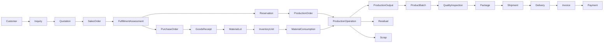

# Canonical Domain Model

This is an assimilation-level model, not final detailed design. Phase 02 owns
bounded-context validation; Phase 04 owns physical data design.

## Proposed domain boundaries

- `BC-IDENTITY`: principals, roles, sessions, credentials, scopes
- `BC-MASTER-DATA`: materials, products, grades, UOM, warehouses, machines
- `BC-SALES`: customers, inquiries, quotations, orders, fulfillment, lost demand
- `BC-PROCUREMENT`: suppliers, purchase orders, inbound commercial commitments
- `BC-INVENTORY`: lots, physical units, locations, ledger, balance, reservations
- `BC-PRODUCTION`: production orders, operations, allocation, transformation facts
- `BC-QUALITY`: inspections, measurements, nonconformance, disposition, release
- `BC-SHIPPING`: packaging, shipment, dispatch, delivery
- `BC-FINANCE-LITE`: operational invoices, payments, allocations, balances
- `BC-REPORTING`: read-only projections, KPIs, operational reporting
- `BC-AUDIT`: business, technical, status, and security evidence
- `BC-INTEGRATION`: Outbox delivery and external adapters

## Proposed end-to-end relationships

## Ownership rule

Every authoritative entity has exactly one write owner. Other domains interact
through commands/contracts and may hold immutable references or read projections.
Inventory is cross-cutting in business use but has one write owner.

## Validation needed

- Portal boundary and MVP phase
- GoodsReceipt/MaterialLot ownership between Procurement and Inventory
- Product/Material/UOM variants
- Real production routing and tracking granularity
- Finance-Lite/external accounting boundary
