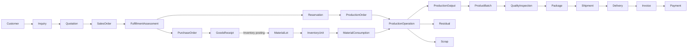

# Canonical Domain Model

This is a Phase 02 design refinement of the assimilation-level model. It does
not authorize physical data design, APIs, or implementation. Phase 04 owns
physical data design. Workshop evidence may keep or replace the proposals
below.

APR-002 approved the Phase 00 seed. The current version is `in_review` because
Phase 02 recorded the Goods Receipt split, portal deferral, and Inventory write
proposal for Material Lot.

## Proposed domain boundaries

- `BC-IDENTITY`: principals, roles, sessions, credentials, scopes
- `BC-MASTER-DATA`: materials, products, grades, UOM, warehouses, machines
- `BC-SALES`: customers, inquiries, quotations, orders, fulfillment, lost demand
- `BC-PROCUREMENT`: suppliers, purchase orders, inbound commercial commitments,
  Goods Receipt commercial orchestration
- `BC-INVENTORY`: lots, physical units, locations, ledger, balance, reservations
- `BC-PRODUCTION`: production orders, operations, allocation, transformation facts
- `BC-QUALITY`: inspections, measurements, nonconformance, disposition, release
- `BC-SHIPPING`: packaging, shipment, dispatch, delivery
- `BC-FINANCE-LITE`: operational invoices, payments, allocations, balances
- `BC-REPORTING`: read-only projections, KPIs, operational reporting
- `BC-AUDIT`: business, technical, status, and security evidence
- `BC-INTEGRATION`: Outbox delivery and external adapters
- `BC-PORTAL`: **proposed/deferred only** — not a confirmed bounded context.
  Customer Portal ordering is formally deferred from MVP pending OQ-010.

Normative capability, inbound/outbound, and forbidden-write detail lives in
[DOM-CAP-BC-001](../../02-domain-business-architecture/CAPABILITY_BOUNDED_CONTEXT_MAP.md).
Normative one-write-owner assignments live in
[DOM-OWN-001](../../02-domain-business-architecture/MODULE_OWNERSHIP_MATRIX.md).

## Proposed end-to-end relationships

Goods Receipt (TERM-019) is one business concept with two write authorities:
Procurement owns commercial orchestration; Inventory owns resulting lot/unit
stock. Genealogy Link (TERM-025) is omitted from this source-fact diagram
because it is a rebuildable projection, not a write-owned source.

## Ownership rule

Every authoritative entity has exactly one write owner. Other domains interact
through commands/contracts and may hold immutable references or read
projections. Inventory is cross-cutting in business use but has one write
owner. Quality and Shipping command inventory lifecycle changes; they do not
write stock tables.

Split facts already recorded as dual-authority are two concepts, not two
writers of one table: Residual fact vs resulting unit; Scrap fact vs stock
movement; Goods Receipt orchestration vs Inventory posting.

## Phase 02 design proposals still requiring workshop confirmation

| Topic | Phase 02 design proposal | Still open |
| --- | --- | --- |
| Portal boundary and MVP phase | Ordering formally deferred from MVP; no confirmed `BC-PORTAL` | OQ-010, FIND-001 |
| Goods Receipt / Material Lot ownership | Procurement orchestrates receipt; Inventory writes lot/unit stock | workshop confirmation; OQ-015, OQ-017 |
| Product / Material / UOM variants | Master-data owned; signed matrix not invented | OQ-001, OQ-002 |
| Real production routing and tracking | Production owns operations and facts; posting points unset | OQ-003, OQ-004 |
| Finance-Lite / external accounting | Finance-Lite is operational only | OQ-012, ASM-010 |
