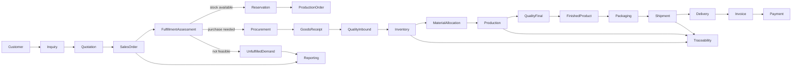

# Architecture Assimilation Report

## Sources and status

This report treats [گزارش معماری و طراحی تفصیلی.docx](D:/projects/NavardKaran/Docs/گزارش%20معماری%20و%20طراحی%20تفصیلی.docx) and [پرامپت جامع نسخه ۲ (1).docx](D:/projects/NavardKaran/Prompts/پرامپت%20جامع%20نسخه%20۲%20(1).docx) as one knowledge base.

The architecture report is a proposed baseline subject to discovery-workshop
validation. [Provenance Classification](PROVENANCE_CLASSIFICATION.md) identifies
the source and maturity of each major claim group, while the
[Multi-Agent Method](MULTI_AGENT_METHOD.md) defines the responsibility,
handoff, synchronization, and validation model. Node.js + TypeScript is the only
accepted backend technology decision. NestJS and all other detailed platform
choices remain proposed evaluation candidates, not implementation defaults.

## Canonical evidence map

- Sources and claim maturity:
  [Source Bibliography](SOURCE_BIBLIOGRAPHY.md) and
  [Provenance Classification](PROVENANCE_CLASSIFICATION.md)
- Assumptions:
  [ASSUMPTIONS.md](../00-governance/registers/ASSUMPTIONS.md)
- Business Glossary:
  [BUSINESS_GLOSSARY.md](../00-governance/registers/BUSINESS_GLOSSARY.md)
- Domain ownership:
  [CANONICAL_DOMAIN_MODEL.md](../00-governance/registers/CANONICAL_DOMAIN_MODEL.md)
- Conceptual entities:
  [CANONICAL_DATA_DICTIONARY.md](../00-governance/registers/CANONICAL_DATA_DICTIONARY.md)
- Proposed lifecycles:
  [STATE_TRANSITION_CATALOGUE.md](../00-governance/registers/STATE_TRANSITION_CATALOGUE.md)
- Known integration boundaries:
  [INTEGRATION_CATALOGUE.md](../00-governance/registers/INTEGRATION_CATALOGUE.md)
- Objective evidence:
  [REQUIREMENTS_TRACEABILITY.md](../00-governance/registers/REQUIREMENTS_TRACEABILITY.md)
- Planned validation:
  [Workshop Agenda](WORKSHOP_AGENDA.md)

These canonical artifacts own their fact types. This report is an assimilation
synthesis and does not silently close an assumption, question, finding, or
decision.

## 1. Project understanding

Foolad Navardkaran needs a unified operational system spanning ERP-lite and MES concerns. Its central purpose is to replace fragmented Excel/paper processes with a controlled source of truth connecting customer demand, supply, physical inventory, production execution, quality release, delivery, operational finance, audit, and bidirectional material [genealogy](../00-governance/registers/BUSINESS_GLOSSARY.md#term-015--genealogy).

The architectural priority is not generic CRUD throughput: it is preservation
of stock correctness, transaction integrity, business-state integrity, and
traceability from supplier
[Goods Receipt](../00-governance/registers/BUSINESS_GLOSSARY.md#term-019--goods-receipt)/
[Material Lot](../00-governance/registers/BUSINESS_GLOSSARY.md#term-006--material-lot)/
[Inventory Unit](../00-governance/registers/BUSINESS_GLOSSARY.md#term-007--inventory-unit)
([Coil](../00-governance/registers/BUSINESS_GLOSSARY.md#term-008--coil)) to
ProductBatch/Package/Shipment/Customer and back again. The MVP is successful
only when a real purchase-to-delivery cycle can run without parallel Excel and
its balances, audit trail, and genealogy reconcile.

Canonical flow:

When no feasible stock, procurement, or production path exists, the flow records
[Unfulfilled Demand](../00-governance/registers/BUSINESS_GLOSSARY.md#term-005--unfulfilled-demand)
as a separate business outcome.

The flow is not strictly linear. It supports partial fulfillment and delivery, multi-Coil inputs, one Coil serving multiple orders under policy, procurement-driven fulfillment, QC hold/reject, rework, residual return, scrap, cancellation, correction by reversal, and lost-demand capture even where no SalesOrder is created.

## 2. Business scope

- Sales/CRM: Customer, Inquiry/RFQ, Quotation, SalesOrder and items, pricing snapshots, confirmation/change/cancellation, promised dates, fulfillment status, overdue status, and unfulfilled-demand cases.
- Customer Portal: customer identity/isolation, quote or order requests, status/documents/notifications; it is a product capability, but its MVP phase conflicts across the sources and requires a sponsor decision.
- Procurement: Supplier, PurchaseOrder, shortage-driven purchasing, receipt, supplier/certificate references, and inbound coordination.
- Inventory/Warehouse: MaterialLot, Coil/Sheet/other InventoryUnit, locations, Ledger, Balance, reservations, transfers, adjustments, quality hold, physical lifecycle, and initial stock cutover.
- Production/MES: ProductionOrder, routing/operations, allocation, staging/issue, consumption, output, residual, scrap, downtime, rework, WIP, mass balance, and genealogy source records.
- Quality: incoming/in-process/final inspections, measurements, nonconformance, quarantine, accept/reject/conditional release, and shipment release gates.
- Shipping/Delivery: packaging, picking/loading, dispatch, partial delivery, delivery confirmation, and controlled stock exit.
- Finance-Lite: operational Invoice, Payment, allocation and customer balance; explicitly not full legal accounting, taxation, or general ledger.
- Reporting/Monitoring: operational dashboards, lost demand, stock, production, quality, fulfillment, OTIF and traceability; near-real-time only where operationally valuable.
- Security/Audit/Integration: RBAC, scoped authorization, customer isolation,
  immutable evidence, a proposed Outbox pattern, equipment/accounting/reporting
  adapters, backup, and recovery.

## 3. Architectural baseline

Except for Node.js + TypeScript under accepted ADR-0001, this entire section is a
**proposed/evaluation baseline**. It records source and synthesis candidates; it
does not accept an architecture, data platform, package, or deployment choice.

- Architecture-style proposal: evaluate a maintainable Modular Monolith, sized
  for a small team and modest concurrent usage, against justified alternatives.
  The source baseline does not justify microservices for MVP, but ADR-0006
  remains proposed.
- Deployment-topology proposal: evaluate one central API, one durable background
  Worker, one database, web UI, Nginx, and Docker Compose on Ubuntu. Kubernetes,
  automatic high availability, and even this exact MVP topology remain
  unapproved under proposed ADR-0008 and OQ-018.
- Accepted backend constraint: Node.js + TypeScript through ADR-0001. NestJS is
  only a framework candidate and requires evidence, an ADR, and version pinning.
- Data-platform proposal: evaluate PostgreSQL as system of record under proposed
  ADR-0007. ORM for ordinary access and controlled SQL for locking, recursive
  genealogy, posting functions, and privileges are candidate mechanisms. Prisma
  is a candidate and cannot settle Inventory Kernel integrity.
- Internal boundaries: one write owner per table/aggregate; cross-module behavior through application/domain contracts; no foreign-module repository or table writes.
- Inventory-pattern proposal: evaluate immutable Inventory Ledger plus current
  Balance projection. The proposed ownership rule permits only the Inventory
  Posting Service to mutate stock state; OQ-017 keeps its mechanism open.
- Traceability pattern: Consumption, Output, Residual and Scrap are authoritative; GenealogyLink is a query projection, not independently editable truth.
- Integration-pattern proposal: evaluate in-process domain events plus a
  transactional Outbox for post-commit and external delivery.
- API/real-time proposal: REST/OpenAPI for canonical state and WebSocket-style
  notifications followed by canonical refresh. Socket.IO is a package candidate,
  not an accepted decision.
- Security posture: server-authoritative sessions and authorization, RBAC plus warehouse/line/object scope, customer isolation, MFA for sensitive/remote roles, and immutable audit evidence.
- Explicit MVP exclusions include Kafka/RabbitMQ without a real driver, Event Sourcing, Redis as stock truth, time-series infrastructure, PLC telemetry, offline-first inventory, Kubernetes, and full accounting.

## 4. Domain boundaries

- Identity/Security owns users, roles, sessions, credentials, scopes and policy enforcement.
- MasterData owns Material, Product, Grade, UOM, Warehouse, Location and Machine definitions.
- Sales owns Customer, Inquiry, Quotation, SalesOrder, SalesOrderItem, FulfillmentAssessment and UnfulfilledDemandCase.
- Procurement owns Supplier, PurchaseOrder and inbound commercial/receipt orchestration; physical stock posting still belongs to Inventory.
- Inventory owns MaterialLot/InventoryUnit stock lifecycle, Ledger, Balance, Reservation, Transfer and Adjustment posting.
- Production owns ProductionOrder, Operation, MaterialAllocation, Consumption, Output, Residual, Scrap, Downtime, Rework and genealogy source facts.
- Quality owns Inspection, Measurement, Nonconformance, disposition and release decisions; it requests coordinated inventory lifecycle changes rather than writing stock tables.
- Shipping owns Package, Shipment, ShipmentItem, Dispatch and Delivery; it requests definitive stock exit through Inventory.
- FinanceLite owns operational Invoice, Payment and allocation, while an external accounting system remains the eventual legal finance authority.
- Reporting is read-only over governed views/projections.
- Audit owns technical/business evidence categories. Under the proposed Outbox
  pattern, Integration owns delivery and adapters, never direct core-table writes.

Inventory is a shared business capability but not a shared writable database kernel.

## 5. Critical business invariants

- Every stock change has exactly one authorized posting path and immutable
  evidence. Under the proposed Ledger+Balance pattern, Ledger and Balance must
  reconcile.
- On-hand, reserved and available quantities cannot become negative; active reservation totals cannot exceed free stock under concurrent requests.
- Availability is derived from on-hand minus reservations and quality hold; Reservation, production Allocation, and actual Consumption are distinct concepts.
- One physical Coil/InventoryUnit has one active physical location at a time and cannot be simultaneously issued, shipped, quarantined, or consumed incompatibly.
- Posted inventory, operational, and financial records are not physically deleted or silently edited; corrections use reversal/correction with reason, authority and audit.
- Operation completion atomically records Consumption, Output/WIP, Residual, Scrap, process loss, genealogy and inventory postings.
- Mass balance must hold within approved tolerance: consumed weight equals good output plus WIP plus returned residual plus scrap plus approved process loss, subject to controlled override.
- A usable residual receives a new InventoryUnit identity linked to its parent; the parent is closed/split. Minimum usable thresholds remain a business decision.
- Genealogy source facts are immutable and must support both supplier-to-customer and customer-to-source tracing, including merge, split, rework and defective-Lot impact analysis.
- Material/product cannot become available or shippable while required QC is pending, quarantined, or rejected; ProductBatch must be released before shipment.
- Shipment content must belong to the same authorized customer/order and reference exactly the permitted Package or ProductBatch form. Shipment without demand requires explicit authority.
- Issued invoices are immutable; void/credit/reversal workflows preserve history. Payment allocations cannot exceed either payment value or invoice open balance.
- Unfulfilled demand is not the same as overdue demand and may exist without a SalesOrder; both must remain separately reportable.
- Historical commercial and specification values are snapshotted on documents so later master-data changes do not rewrite history.
- Authorization is enforced on the backend. Sensitive adjustments use separation of duties; customer data isolation applies to reads, exports, notifications and documents.
- Idempotency is mandatory for retryable commands and external submissions; a network retry must not duplicate receipt, posting, shipment, payment or completion.

## 6. Critical state machines

- SalesOrder: DRAFT → SUBMITTED → CONFIRMED → IN_PRODUCTION → PARTIALLY_FULFILLED → FULFILLED → CLOSED, with ON_HOLD and controlled CANCEL_PENDING → CANCELLED branches. Post-confirmation changes require SalesOrderChange rather than regression to Draft.
- PurchaseOrder: DRAFT → SUBMITTED → APPROVED → SENT → PARTIALLY_RECEIVED → RECEIVED → CLOSED, with hold/cancel branches.
- GoodsReceipt: DRAFT → RECEIVED → QC_HOLD → POSTED, or controlled cancellation before/through reversal according to posting status.
- ProductionOrder: DRAFT → PLANNED → RELEASED → IN_PROGRESS, with PAUSED, PARTIALLY_COMPLETED, COMPLETED, CLOSED, ON_HOLD, CANCELLED and ABORTED branches. Release requires material readiness; completion requires atomic mass-balance posting.
- InventoryUnit/MaterialLot: PENDING_QC → AVAILABLE → RESERVED → ISSUED_TO_PRODUCTION → PARTIALLY_CONSUMED/CONSUMED, with QUARANTINED, PACKED, SHIPPED, RETURNED, SCRAPPED and CLOSED branches constrained by unit kind.
- QualityInspection: PLANNED → IN_PROGRESS → COMPLETED → ACCEPTED/REJECTED/CONDITIONAL/QUARANTINED. Reopening and exceptional release require QualityManager authority and audit.
- Shipment: DRAFT → READY → LOADING → DISPATCHED → PARTIALLY_DELIVERED/DELIVERED → CLOSED. Dispatch is not reversed by direct state regression; return/correction workflows are required.
- Invoice: DRAFT → ISSUED → PARTIALLY_PAID → PAID → CLOSED, with OVERDUE and VOID_PENDING → VOIDED branches.

All transition catalogues still require workshop confirmation of guards, responsible roles, side effects, emitted events and customer-visible status mappings.

## 7. Data ownership

- Sales is authoritative for customer demand, order commitments, fulfillment assessments and lost-demand records.
- Procurement is authoritative for suppliers and purchasing commitments.
- Inventory is authoritative for physical stock identity, location, quantity,
  reservation, and every inventory movement. Ledger and Balance are proposed
  representations of that authority.
- Production is authoritative for execution facts and material-transformation genealogy facts.
- Quality is authoritative for inspection evidence and disposition/release decisions.
- Shipping is authoritative for packages, shipment workflow and delivery evidence.
- FinanceLite is authoritative only for operational invoices/payments inside this system; the external accounting system will own legal accounting when integrated.
- Identity/Security is authoritative for principals and access policy; Audit is authoritative for immutable evidence; Reporting owns no transactional truth.
- MasterData is authoritative for shared definitions. Canonical terms such as Customer, SalesOrder, SalesOrderItem, Material, MaterialLot, Coil, ProductionOrder, InventoryUnit, ProductBatch, Shipment and Invoice cannot be redefined per module.

## 8. Integration boundaries

All mechanisms in this section are proposed/evaluation baselines; none selects a
package or implementation design.

- Internal synchronous integration uses application/domain commands and read contracts; direct cross-module table writes are forbidden.
- The proposed event/Outbox pattern decouples in-process reactions and persists
  external-critical or retryable work in the business transaction for
  idempotent Worker processing.
- Socket.IO is a real-time package candidate. Any selected mechanism would
  publish authorized, minimal post-commit notifications and require clients to
  re-read canonical state.
- Reporting tools such as Metabase/Power BI receive read-only governed views, never transactional write access.
- Future integrations include weighbridge, barcode/industrial printing, legal accounting export/API, customer portal, PLC/telemetry, CMMS and APS.
- Each adapter validates, maps and submits a core command; equipment identities require controlled credentials, network restrictions and key rotation.

## 9. Non-functional requirements

- Scale baseline: approximately 15–25 concurrent and fewer than 100 total users; actual transaction/data volumes still require measurement.
- Performance baseline: LAN UI P95 around two seconds and normal command handling around one second; near-real-time notification target is roughly two to five seconds, not a telemetry SLA.
- Concurrency: deterministic row-lock order, transaction-scoped posting, idempotency keys and concurrent-reservation tests are mandatory.
- Reliability proposal: evaluate PostgreSQL as canonical storage and preserve the
  rule that post-commit asynchronous delivery cannot alter transaction truth.
  A Docker Compose single-server topology and its lack of HA are evaluation
  baselines, not accepted commitments.
- Recovery: proposed RPO 15–60 minutes and RTO 4–8 hours are negotiation baselines, not yet business-approved. Automated backups, off-site copies and restore drills are required.
- Security: secure HttpOnly/SameSite cookies, password hardening, MFA for sensitive/remote access, lockout/session controls, least privilege, object-level checks, customer isolation and secret redaction.
- Auditability: Technical Audit, Business Event, Status History, Inventory Ledger and Security Log remain separate evidence types with correlation identifiers and retention policy.
- Data integrity: exact decimal handling, database constraints, immutable posting, uniqueness and reconciliation jobs; no binary floating point for weight or money.
- Testability: unit, selected-data-platform integration, API, E2E, inventory/
  property, concurrency, genealogy, state-transition, authorization/isolation,
  outage, backup/restore, and UAT coverage. PostgreSQL and detailed test tools
  remain candidates.
- Operability: structured logging, health checks, worker/asynchronous-delivery
  monitoring, backup alerts, and documented rollback/recovery. Outbox and
  OpenTelemetry remain proposed choices.
- UX: Persian RTL, scan-friendly, low-error workflows for PC/industrial tablet; factory LAN is assumed generally available, but inventory is not offline-first.

## 10. Node.js migration impact

The accepted technology-family override is architectural, not a vocabulary
replacement. Every framework, frontend, package, persistence, scheduler,
testing, observability, and deployment detail below is a
**proposed/evaluation baseline** governed by OQ-018:

- Framework/module system: evaluate NestJS against modularity, transaction orchestration, team skill and long-term support; pin Node.js LTS and framework versions only through ADR.
- Dependency injection: define provider/module visibility so module boundaries cannot be bypassed.
- Authentication: select maintained session, password-hash and MFA libraries while preserving secure-cookie and revocation requirements.
- Authorization: implement RBAC, warehouse/line scope, object policy and customer isolation through server-side guards/policies plus service-level checks.
- Data access: evaluate Prisma for standard persistence, but explicitly design raw PostgreSQL access for row locks, SKIP LOCKED, recursive CTEs, advanced constraints and privileges.
- Transaction handling: guarantee connection affinity and one atomic transaction for Inventory Posting and operation completion; decide between Prisma interactive transactions and a database posting function/API.
- Decimal values: select a decimal library and JSON/OpenAPI serialization convention; JavaScript Number is unacceptable for authoritative weight or money.
- Validation/API: choose DTO/schema validation and OpenAPI generation strategy without duplicating or weakening domain invariants.
- Frontend: evaluate the client architecture and framework; React references are
  candidates rather than accepted defaults.
- Real-time: evaluate how SignalR concepts map to a Node-compatible notification
  mechanism, authorization, reconnect behavior, and Outbox-after-commit
  publication. Socket.IO and any scale adapter are candidates only.
- Background work: select a durable PostgreSQL-backed scheduler/queue that supports retries, leases, idempotency and observability without introducing Redis merely by framework convention.
- Logging/observability: select structured logging, redaction, correlation and optional OpenTelemetry packages compatible with API and Worker.
- Testing: select Jest or Vitest, Testcontainers PostgreSQL, Playwright and deterministic concurrency/property-test tooling.
- Deployment: evaluate reproducible Node LTS images, migration execution,
  non-root runtime, health checks, graceful API/Worker shutdown, and
  memory/event-loop monitoring within proposed ADR-0008.
- Package governance: add dependency pinning, vulnerability review and upgrade policy because the Node ecosystem shifts more rapidly than the former .NET baseline.

The migration does not alter the underlying business integrity goals, module
write-ownership requirements, genealogy semantics, or audit requirements.
PostgreSQL, Ledger+Balance, and Outbox remain proposed architecture candidates
until their owning ADRs are accepted.

## 11. Supported assumptions

- One legal entity and one principal production site for the initial release.
- One Coil has one active physical location at a time.
- Base inventory is primarily weight-based, while count and dimensions may also be recorded; the definitive UOM matrix is not yet approved.
- Most finished products use batch-level tracking; bundle/piece exceptions require confirmation.
- Factory LAN is generally available although public internet may fail; operators use browsers on PCs or industrial tablets.
- Production events are human/low-frequency, not millisecond PLC telemetry.
- Standard/manual QR/barcode printing is sufficient initially.
- Operational documents are retained and corrected rather than deleted.
- Commercial/tax/specification values and correction evidence are assumed to be
  preserved under ASM-012.
- An external specialist accounting product is or will become legal financial authority.
- A small delivery/maintenance team is assumed to favor low operational
  complexity; Modular Monolith remains an architecture-style proposal under
  OQ-018 and proposed ADR-0006.

## 12. Open Questions Register

The authoritative normalized questions are maintained in
[OPEN_QUESTIONS.md](../00-governance/registers/OPEN_QUESTIONS.md). This report's
initial question set was promoted there as OQ-001 through OQ-018.

## 13. Architectural risks

The authoritative normalized risks are maintained in
[RISKS.md](../00-governance/registers/RISKS.md). The major initial risks include
parallel Excel, opening-stock mismatch, Inventory Kernel concurrency, decimal
precision, genealogy divergence, module-boundary erosion, portal exposure,
customer-data leakage, Worker durability, untested recovery, finance scope
expansion, operational skill gaps, absent data ownership, and premature coding.

## 14. Explicit Phase 02 deferrals

The source extraction and Phase 01 synthesis do not contain enough validated
detail to finalize the following. They are explicitly deferred to Phase 02 and
their linked owning phases rather than being invented here:

- named stakeholders, delegates, policy approvers, data stewards, and detailed
  RACI assignments;
- authoritative product/material families, grade/specification structure, UOM
  matrix, conversion, precision, rounding, and tolerance terminology;
- detailed Inquiry, Quotation, SalesOrderItem, FulfillmentAssessment,
  UnfulfilledDemandCase, Supplier, PurchaseOrder, GoodsReceipt, MaterialLot,
  InventoryUnit, Coil, Reservation, Transfer, Adjustment, ProductionOperation,
  Consumption, Output, Residual, Scrap, ProductBatch, Package, ShipmentItem,
  Delivery, Quality, Invoice, Payment, and correction evidence attributes;
- validated As-Is/To-Be processes, routing steps, posting points, approval
  authorities, exception flows, and handoffs;
- tracking granularity, identifiers, merge/split/rework relationships, and
  representative bidirectional genealogy;
- complete lifecycle guards, responsible roles, effects, events, rejected
  behavior, customer-visible mappings, and reversal/correction semantics;
- quality plans, measurements, limits, samples, nonconformance, disposition,
  release, and exceptional authority;
- portal scope, customer-visible data/actions, Finance-Lite boundary, external
  integration contracts, and cutover ownership;
- measurable capacity, recovery, retention, network, security, and operating
  requirements; and
- decomposition of REQ-OBJ-001 through REQ-OBJ-005 into validated requirements,
  rules, evidence, and acceptance criteria.

The [Workshop Agenda](WORKSHOP_AGENDA.md) plans the evidence collection. Open
items remain in OQ-001 through OQ-018, ASM-001 through ASM-012, and the Risk and
Review Findings Registers.

## 15. Architecture readiness assessment

- Ready for detailed architecture: Conditionally. The documents provide a strong baseline: coherent module boundaries, a substantial canonical data model, principal state machines, inventory/traceability patterns, an end-to-end reference scenario, security posture and architecture-control methodology.
- Requires clarification: Yes. UOM, routing, QC, reservation, shipment/closure, portal scope, integrations, capacity, cutover and recovery decisions materially affect detailed design.
- Contains architectural conflicts: Yes, but limited and visible. The main cross-source conflict is portal phasing/MVP scope. Secondary tensions include proposed versus final frontend/tool choices, partial-shipment tolerances, and application-versus-database Inventory Posting.
- Contains missing information: Yes. Validated shop-floor process evidence, approval matrices, infrastructure survey, external-system contracts, data volumes, cutover RACI and package-level Node.js ADRs are incomplete.
- Overall verdict: approved by `APR-003` as an accurate assimilation baseline,
  methodology/provenance package, and planned-workshop readiness record. Phase
  02 and workshop execution remain inactive until checkpoint completion. This
  approval does not accept detailed design or proposed technologies and is not
  implementation readiness.

OQ-001 through OQ-018 and proposed ADR-0006 through ADR-0008 carry forward.
The APR-003 Git checkpoint and commit are pending. No implementation has been
started or authorized.
