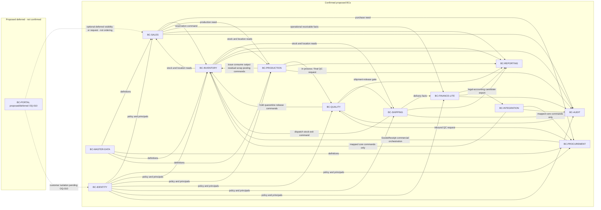

# Capability and Bounded-Context Map

## Purpose

Map Foolad Navardkaran business capabilities to proposed bounded contexts and
record write-ownership, inbound/outbound relationships, and explicit
non-ownership. This artifact refines
[GOV-DOMAIN-001](../00-governance/registers/CANONICAL_DOMAIN_MODEL.md) for Phase
02 review. It does not accept ADRs, close open questions, or authorize
implementation.

`IMPLEMENTATION_AUTHORIZED` remains `false`. Node.js + TypeScript (ADR-0001) is
the only accepted technology decision. Bounded contexts here are business
boundaries, not framework or package choices.

## Scope

- In scope: capability-to-context mapping for the confirmed BC IDs from
  GOV-DOMAIN-001; write-owned concepts; forbidden writes; inbound/outbound
  relationships; a proposed/deferred portal treatment pending OQ-010.
- Out of scope: physical schemas, APIs, packages, deployment, workshop
  execution, owner-signed policy, and closing OQ-001 through OQ-018.

## Sources and dependencies

- Sources: [ASM-REPORT-001](../01-project-assimilation/ARCHITECTURE_ASSIMILATION_REPORT.md)
  sections 2, 4, and 7; [GOV-DOMAIN-001](../00-governance/registers/CANONICAL_DOMAIN_MODEL.md);
  glossary [GOV-GLOSSARY-001](../00-governance/registers/BUSINESS_GLOSSARY.md);
  dictionary [GOV-DATA-DICT-001](../00-governance/registers/CANONICAL_DATA_DICTIONARY.md).
- Canonical dependencies: GOV-DOMAIN-001, ASM-REPORT-001.
- Temporary workshop identities: [DOM-ROSTER-001](WORKSHOP_ROSTER.md) under
  ASM-013 / FIND-020 / OQ-019 `treating`. They confer no approval authority.

## Design

### Capability to bounded-context mapping

Terms below use glossary IDs on first use. Conceptual entities remain
`proposed` until Phase 02 workshop validation.

| Business capability | Primary BC | Supporting BCs | Notes |
| --- | --- | --- | --- |
| Identity, sessions, RBAC, scopes | `BC-IDENTITY` | `BC-AUDIT` | Server-authoritative policy. |
| Shared definitions: material, product, grade, UOM, warehouse, machine | `BC-MASTER-DATA` | `BC-IDENTITY` | UOM matrix open (OQ-001). |
| Sales/CRM: [Customer](../00-governance/registers/BUSINESS_GLOSSARY.md#term-001--customer) (TERM-001), [Inquiry](../00-governance/registers/BUSINESS_GLOSSARY.md#term-002--inquiry) (TERM-002), [Quotation](../00-governance/registers/BUSINESS_GLOSSARY.md#term-020--quotation) (TERM-020), [Sales Order](../00-governance/registers/BUSINESS_GLOSSARY.md#term-003--sales-order) (TERM-003), [Fulfillment Assessment](../00-governance/registers/BUSINESS_GLOSSARY.md#term-004--fulfillment-assessment) (TERM-004), [Unfulfilled Demand](../00-governance/registers/BUSINESS_GLOSSARY.md#term-005--unfulfilled-demand) (TERM-005) | `BC-SALES` | `BC-INVENTORY`, `BC-PROCUREMENT`, `BC-PRODUCTION`, `BC-FINANCE-LITE` | Commercial demand owner. |
| Procurement: [Supplier](../00-governance/registers/BUSINESS_GLOSSARY.md#term-021--supplier) (TERM-021), [Purchase Order](../00-governance/registers/BUSINESS_GLOSSARY.md#term-022--purchase-order) (TERM-022), inbound commercial commitment, [Goods Receipt](../00-governance/registers/BUSINESS_GLOSSARY.md#term-019--goods-receipt) (TERM-019) orchestration | `BC-PROCUREMENT` | `BC-INVENTORY`, `BC-QUALITY`, `BC-MASTER-DATA` | Commercial receipt vs stock posting are split. |
| Inventory/warehouse: [Material Lot](../00-governance/registers/BUSINESS_GLOSSARY.md#term-006--material-lot) (TERM-006), [Inventory Unit](../00-governance/registers/BUSINESS_GLOSSARY.md#term-007--inventory-unit) (TERM-007) / [Coil](../00-governance/registers/BUSINESS_GLOSSARY.md#term-008--coil) (TERM-008), Ledger, Balance, [Reservation](../00-governance/registers/BUSINESS_GLOSSARY.md#term-009--reservation) (TERM-009) | `BC-INVENTORY` | `BC-QUALITY`, `BC-PRODUCTION`, `BC-SHIPPING`, `BC-PROCUREMENT` | Shared business use; one write owner. |
| Production/MES: [Production Order](../00-governance/registers/BUSINESS_GLOSSARY.md#term-011--production-order) (TERM-011), operations, [Material Allocation](../00-governance/registers/BUSINESS_GLOSSARY.md#term-010--material-allocation) (TERM-010), consumption, output, [Residual](../00-governance/registers/BUSINESS_GLOSSARY.md#term-012--residual) (TERM-012), [Scrap](../00-governance/registers/BUSINESS_GLOSSARY.md#term-013--scrap) (TERM-013), [Product Batch](../00-governance/registers/BUSINESS_GLOSSARY.md#term-014--product-batch) (TERM-014), [Genealogy](../00-governance/registers/BUSINESS_GLOSSARY.md#term-015--genealogy) (TERM-015) source facts | `BC-PRODUCTION` | `BC-INVENTORY`, `BC-QUALITY`, `BC-MASTER-DATA` | Routing/posting points open (OQ-003). |
| Quality: inspection, measurement, nonconformance, hold, [Released](../00-governance/registers/BUSINESS_GLOSSARY.md#term-016--released) (TERM-016) | `BC-QUALITY` | `BC-INVENTORY`, `BC-SHIPPING`, `BC-PRODUCTION` | Requests stock lifecycle; does not write stock tables. |
| Shipping/delivery: [Package](../00-governance/registers/BUSINESS_GLOSSARY.md#term-023--package) (TERM-023), [Shipment](../00-governance/registers/BUSINESS_GLOSSARY.md#term-017--shipment) (TERM-017), dispatch, delivery | `BC-SHIPPING` | `BC-INVENTORY`, `BC-SALES`, `BC-QUALITY` | Requests definitive stock exit; does not write stock tables. |
| [Finance-Lite](../00-governance/registers/BUSINESS_GLOSSARY.md#term-018--finance-lite) (TERM-018): operational Invoice, [Payment](../00-governance/registers/BUSINESS_GLOSSARY.md#term-024--payment) (TERM-024), allocation, customer balance | `BC-FINANCE-LITE` | `BC-SALES`, `BC-SHIPPING`, `BC-INTEGRATION` | Not legal accounting (OQ-012, ASM-010). |
| Operational reporting, KPIs, traceability query | `BC-REPORTING` | all transactional BCs | Read-only projections. |
| Technical, business, status, and security evidence | `BC-AUDIT` | all BCs | Immutable evidence; not transactional truth. |
| Outbox delivery and external adapters | `BC-INTEGRATION` | `BC-IDENTITY`, `BC-FINANCE-LITE`, equipment/accounting candidates | Adapters submit core commands; never write core tables (INT-001, adapter rule). |
| Customer Portal visibility, request, documents, ordering | **unconfirmed** — see proposed/deferred `BC-PORTAL` | `BC-SALES`, `BC-IDENTITY` | Pending OQ-010 / FIND-001. Not a confirmed BC. |

### Context map

Relationships are proposed command/read/posting contracts from ASM-REPORT-001.
They are not accepted integration protocols.

### Goods Receipt split

TERM-019 is one business concept with two write authorities. This is a
normative Phase 02 proposal taken from ASM-REPORT-001 section 4 and GOV-DOMAIN-001
validation item "GoodsReceipt/MaterialLot ownership". It is not yet
workshop-confirmed.

| Concern | Write owner | Must not write |
| --- | --- | --- |
| Commercial/inbound orchestration of GoodsReceipt against PurchaseOrder or other authorized inbound reference | `BC-PROCUREMENT` | Ledger, Balance, Inventory Unit quantity/location, Reservation |
| Physical stock posting and resulting [Material Lot](../00-governance/registers/BUSINESS_GLOSSARY.md#term-006--material-lot) / Inventory Unit identity and quantity | `BC-INVENTORY` via Inventory Posting Service | Supplier commercial commitment, PurchaseOrder lifecycle |

`ENT-MATERIAL-LOT` now records the Phase 02 Inventory write proposal and still
requires workshop confirmation. This map **proposes** Inventory as write owner
of lot/unit stock identity, with Procurement holding immutable
supplier/purchase/certificate references. Workshop evidence must confirm or
replace that split (OQ-003, OQ-011, OQ-015).

### Customer Portal — unconfirmed, formally deferred from MVP ordering

Sources conflict on whether Customer Portal is excluded from MVP or partially
included (FIND-001, OQ-010, INT-007). This map **does not decide OQ-010**.

Proposed scope pending OQ-010:

- **Customer Portal ordering is formally deferred from MVP.** It is not a
  confirmed Phase 02 capability and must not be treated as in-scope work.
- **Visibility and request** (status/documents and quote-or-order *request*
  capture) remain **optional deferred** candidates. They may be evaluated only
  after a sponsor decision on OQ-010. They are not authorized by this artifact.
- No confirmed `BC-PORTAL`. The label `BC-PORTAL` appears only as
  **proposed/deferred**. Internal `BC-SALES` remains the write owner of Customer,
  Inquiry, Quotation, and Sales Order regardless of any future portal channel.
- RISK-007 (premature portal exposure) remains open.

### Bounded-context catalogue

Each context lists purpose, inbound/outbound relationships, write-owned
concepts, and forbidden writes. "Write" means authoritative mutation of the
owning concept. Other contexts may send commands and may hold immutable
references or read projections.

#### BC-IDENTITY

- Purpose: principals, roles, sessions, credentials, and authorization scopes.
- Inbound: authentication/session requests from all operational contexts;
  optional deferred portal identity if OQ-010 later includes a customer channel.
- Outbound: policy decisions and principal identifiers consumed by all BCs;
  security evidence to `BC-AUDIT`.
- Write-owned: users, roles, sessions, credentials, scopes, policy bindings.
- Must not write: any commercial, stock, production, quality, shipment, or
  finance documents; reporting projections.

#### BC-MASTER-DATA

- Purpose: shared definitional data used by transactional contexts.
- Inbound: steward-maintained definitions; reads from all operational BCs.
- Outbound: material, product, grade, UOM, warehouse, location, and machine
  definitions.
- Write-owned: Material, Product, Grade, UOM, Warehouse, Location, Machine
  (assimilation list; attribute detail deferred per ASM-REPORT-001 section 14).
- Must not write: transactional stock, orders, inspections, shipments, or
  invoices. Historical documents snapshot values so later master-data edits do
  not rewrite posted history (ASM-012; proposed).

#### BC-SALES

- Purpose: customer commercial demand from Inquiry through Sales Order,
  fulfillment path, and lost-demand capture.
- Inbound: Customer/Inquiry/Quotation/order commands from internal Sales actors;
  inventory availability and reservation results; procurement and production
  feasibility signals; optional deferred portal visibility/request if OQ-010
  later permits them.
- Outbound: reservation commands to `BC-INVENTORY`; purchase-need commands to
  `BC-PROCUREMENT`; production-need commands to `BC-PRODUCTION`; operational
  receivable facts to `BC-FINANCE-LITE`; unfulfilled-demand facts to
  `BC-REPORTING`.
- Write-owned: Customer, Inquiry, Quotation, Sales Order, Sales Order Item,
  Fulfillment Assessment, Unfulfilled Demand.
- Must not write: Ledger, Balance, Inventory Unit, Reservation records,
  PurchaseOrder, GoodsReceipt stock effects, Production Order execution facts,
  QualityInspection, Shipment, Invoice, Payment.

#### BC-PROCUREMENT

- Purpose: suppliers, purchasing commitments, and inbound commercial
  orchestration including GoodsReceipt as a commercial/receiving document.
- Inbound: shortage/purchase-need from `BC-SALES` or production planning;
  supplier and certificate references; weighbridge/manual receiving evidence
  (device/protocol open: OQ-011).
- Outbound: GoodsReceipt posting commands to `BC-INVENTORY`; inbound QC
  requests to `BC-QUALITY`.
- Write-owned: Supplier, PurchaseOrder, GoodsReceipt commercial/orchestration
  record (TERM-019 orchestration side).
- Must not write: Ledger, Balance, Inventory Unit quantity/location,
  Reservation, Production Order, Shipment, Invoice.

#### BC-INVENTORY

- Purpose: physical stock identity, location, quantity, reservation, and every
  inventory movement. Inventory is a shared business capability with one write
  owner. Under the proposed Ledger+Balance pattern, only the Inventory Posting
  Service mutates stock state (OQ-017 keeps the mechanism open).
- Inbound: reservation commands from Sales; GoodsReceipt posting commands from
  Procurement; issue/consume/output/residual/scrap posting commands from
  Production; hold/quarantine/release commands from Quality; dispatch stock-exit
  commands from Shipping; cutover/adjustment commands under controlled
  authority (OQ-015).
- Outbound: availability and location reads to Sales, Production, Shipping, and
  Quality; posting evidence to `BC-AUDIT`; stock projections to `BC-REPORTING`.
- Write-owned: Material Lot (proposed; confirmation required), Inventory Unit /
  Coil / Sheet / reusable Residual *identity and quantity*, Ledger, Balance,
  Reservation, Transfer, Adjustment postings.
- Must not write: Sales Order commercial snapshot, PurchaseOrder commercial
  lifecycle, QualityInspection dispositions, Production transformation facts,
  Shipment workflow, Invoice/Payment, GenealogyLink projection rows as
  independent truth.

#### BC-PRODUCTION

- Purpose: authorized production plans, operations, allocations, and material
  transformation facts that are the source of genealogy.
- Inbound: production-need from Sales; stock availability and issue results from
  Inventory; quality dispositions; master-data routing definitions (routing
  itself open: OQ-003).
- Outbound: posting commands to `BC-INVENTORY` for issue, consumption, output,
  residual identity, and scrap stock effect; QC requests to `BC-QUALITY`;
  immutable genealogy source facts consumed by `BC-REPORTING`.
- Write-owned: Production Order, Production Operation, Material Allocation,
  Consumption, Output, Residual *creation/disposition fact*, Scrap
  *creation/disposition fact*, Product Batch, rework/downtime facts recorded in
  assimilation.
- Must not write: Ledger, Balance, Reservation, Sales Order, PurchaseOrder,
  QualityInspection, Shipment, Invoice. Residual *resulting unit identity and
  quantity* and scrap *stock movement* are posted by Inventory, not by
  Production table writes.

#### BC-QUALITY

- Purpose: inspection evidence and disposition/release decisions that gate
  availability and shipment.
- Inbound: inbound QC from Procurement/Inventory; in-process/final QC from
  Production; shipment-release checks from Shipping.
- Outbound: hold/quarantine/release *commands* to `BC-INVENTORY`; shipment-gate
  results to `BC-SHIPPING`. Quality plans, limits, samples, and exceptional
  authority remain open (OQ-005).
- Write-owned: QualityInspection, measurements, nonconformance, disposition,
  Released decision.
- Must not write: stock tables (Ledger, Balance, Inventory Unit quantity),
  Reservation, Sales Order, Production transformation facts, Shipment records,
  Invoice.

#### BC-SHIPPING

- Purpose: packaging, shipment grouping, dispatch, and delivery evidence.
  Dispatch causes definitive stock exit through Inventory. Shipment without
  demand requires explicit authority (ASM-REPORT-001 invariant; authority matrix
  unvalidated).
- Inbound: released Product Batch / Package eligibility; customer/order
  authorization from Sales; quality release gate.
- Outbound: stock-exit command to `BC-INVENTORY` on dispatch; delivery facts to
  `BC-FINANCE-LITE`.
- Write-owned: Package, Shipment, ShipmentItem, Dispatch, Delivery.
- Must not write: Ledger, Balance, Inventory Unit quantity, Reservation,
  QualityInspection, Sales Order commercial snapshot, Invoice.

#### BC-FINANCE-LITE

- Purpose: operational invoices, payments, allocations, and customer balances
  inside this system. External accounting remains legal authority unless
  explicitly changed (ASM-010, OQ-012).
- Inbound: delivery/commercial facts from Shipping and Sales.
- Outbound: candidate legal-accounting export via `BC-INTEGRATION` when
  contracts exist.
- Write-owned: operational Invoice, Payment, allocation, operational customer
  balance.
- Must not write: general ledger / legal books, stock tables, Sales Order
  closure policy (closure rule open: OQ-007), Shipment workflow.

#### BC-REPORTING

- Purpose: read-only operational dashboards, lost-demand, stock, production,
  quality, fulfillment, OTIF, and genealogy query.
- Inbound: governed views/projections from transactional BCs.
- Outbound: none that mutate transactional truth. External reporting tools
  (INT-004) receive read-only access.
- Write-owned: none of the transactional concepts. May materialize projections
  including GenealogyLink as a **query projection**, not independently editable
  truth.
- Must not write: any transactional table or posting.

#### BC-AUDIT

- Purpose: immutable technical, business-event, status-history, and security
  evidence with correlation identifiers.
- Inbound: evidence from all BCs.
- Outbound: authorized audit reads.
- Write-owned: audit evidence records.
- Must not write: business documents or stock as a substitute posting path.

#### BC-INTEGRATION

- Purpose: proposed Outbox delivery and external adapters (weighbridge,
  printing, legal accounting, future portal, PLC/CMMS/APS as catalogue
  entries). All mechanisms remain proposed (INT-001 through INT-010).
- Inbound: post-commit delivery work persisted with the business transaction
  under the proposed Outbox pattern.
- Outbound: mapped, authorized core commands into owning BCs. Adapters never
  write core transactional tables.
- Write-owned: outbox/delivery and adapter-run records only.
- Must not write: Ledger, Balance, orders, inspections, shipments, invoices.

#### BC-PORTAL (proposed/deferred — not confirmed)

- Purpose: *if later authorized*, an external customer channel for isolation,
  visibility, requests, documents, or notifications.
- Status: **proposed/deferred**. Ordering is formally deferred from MVP pending
  OQ-010. Visibility and request remain optional deferred. This is not a
  confirmed bounded context.
- Write-owned: none in MVP under this proposal. Any future portal submission
  would create or update Sales-owned concepts through `BC-SALES` commands, not
  by writing Sales tables from a portal module.
- Must not write: any core transactional table.

## Alternatives and consequences

Keeping portal as an unconfirmed/deferred context rather than folding it into
`BC-SALES` preserves FIND-001 visibility and avoids implying an MVP channel.
Collapsing portal into Sales internally is compatible later if OQ-010 excludes
the channel; that would still not authorize ordering in MVP.

Merging GoodsReceipt entirely into Inventory would hide commercial receiving
orchestration; merging stock posting into Procurement would break the one-writer
inventory rule. The split above is the assimilation proposal, not a closed
decision.

## Traceability

- Requirements: REQ-OBJ-001 through REQ-OBJ-004 (proposed decomposition belongs
  to Phase 02; this map does not assign REQ-* IDs).
- Rules/invariants: ASM-REPORT-001 section 5; one write owner per concept
  (GOV-DOMAIN-001).
- Risks: RISK-001, RISK-003, RISK-006, RISK-007, RISK-011.
- Verification: Phase 02 workshop (blocked for execution by OQ-019); independent
  review of this in_review draft.

## Open items

### Validation needed (linked to open questions)

These items remain open. This artifact does not answer or close them.

| Validation needed | Linked records |
| --- | --- |
| Authoritative UOM, conversion, precision, rounding by family | OQ-001, ASM-003 |
| Coil quantity: weight only vs weight plus length | OQ-002 |
| Real routing, measurement, and official posting points | OQ-003 |
| Batch / bundle / piece tracking granularity | OQ-004, ASM-004 |
| Quality plans, limits, samples, release authority | OQ-005 |
| Partial-shipment / over-production / over-delivery tolerances | OQ-006, FIND-003 |
| Sales Order closure: delivery, payment, or both | OQ-007 |
| Reservation expiry, priority, one-Coil-to-many-orders | OQ-008 |
| Residual vs scrap threshold | OQ-009 |
| Customer Portal phase and allowed customer actions | OQ-010 `treating`, FIND-001, RISK-007; ordering formally deferred from MVP |
| Weighbridge device, protocol, fallback | OQ-011 |
| Legal accounting system and Finance-Lite boundary | OQ-012, ASM-010 |
| Organization and site model | OQ-013, ASM-001 |
| Volumes for later physical design | OQ-014 |
| Opening-stock cutover RACI and freeze | OQ-015, RISK-002 |
| Recovery/retention commitments | OQ-016 |
| Inventory Posting mechanism | OQ-017, FIND-004 |
| Detailed platform ADRs beyond ADR-0001 | OQ-018 |
| Named workshop participants and owner-signed decisions | OQ-019 `treating`, ASM-013, FIND-020 |
| GoodsReceipt / Material Lot ownership confirmation | GOV-DOMAIN-001 validation list; TERM-019 split above |

- Questions: OQ-001 through OQ-018 remain unanswered. OQ-010 and OQ-019 remain
  `treating`. ASM-014 scopes the listed questions out of the design-gate.
- Assumptions: ASM-001 through ASM-014 remain unconfirmed as business facts.

## Review evidence

- Self-check: [SELF_CHECK.md](SELF_CHECK.md)
- Independent review: [INDEPENDENT_REVIEW.md](INDEPENDENT_REVIEW.md)
- Reconciliation: [RECONCILIATION.md](RECONCILIATION.md)
