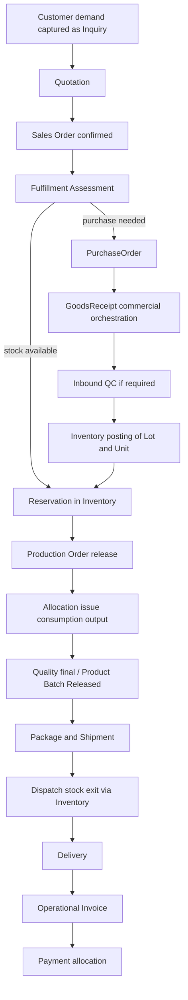
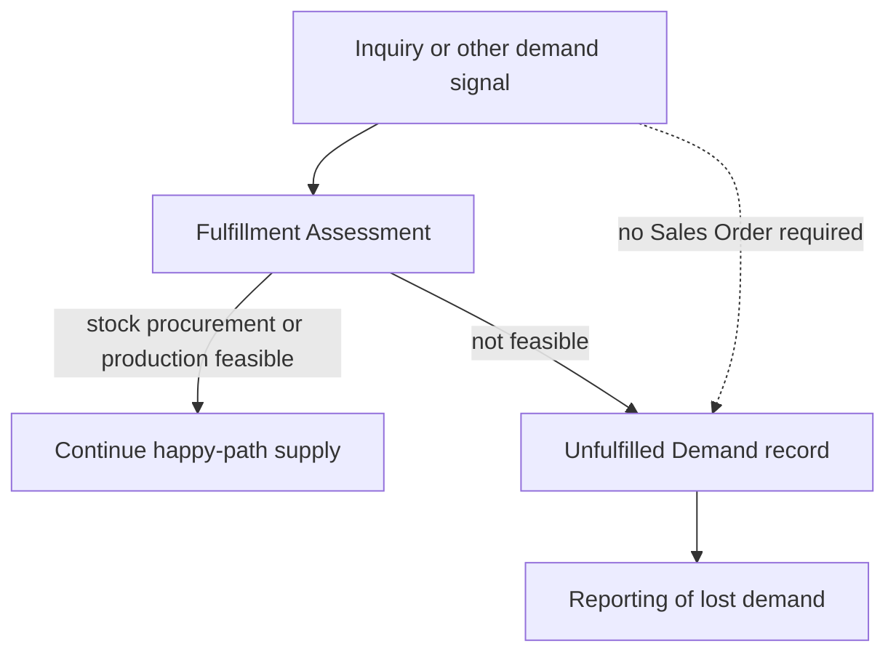
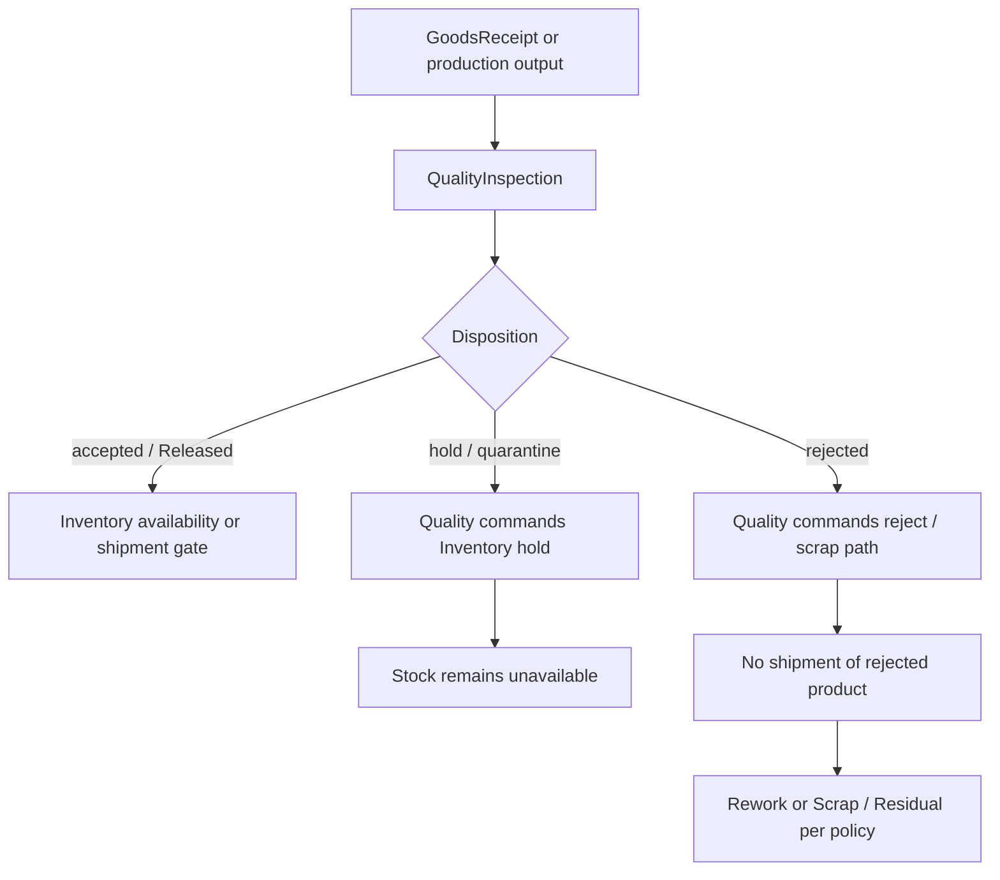
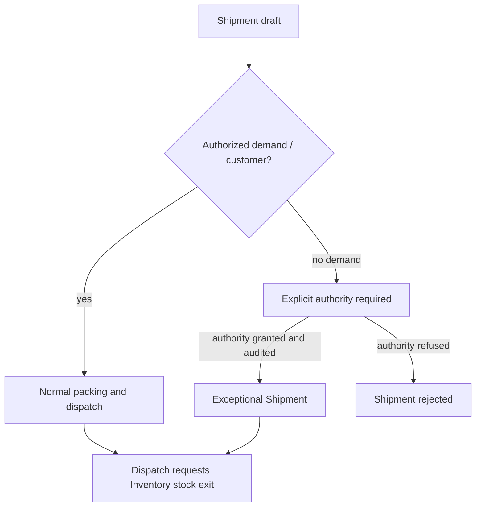

# As-Is and To-Be Process Maps

## Purpose

Describe the synthesized As-Is operating picture and the proposed To-Be
inquiry-to-payment flow, including recorded exception paths, for Foolad
Navardkaran ERP/MES. This artifact prepares workshop validation. It is **not** a
field study and **not** an approved operating procedure.

`IMPLEMENTATION_AUTHORIZED` remains `false`.

## Scope

- In scope: As-Is synthesis from Phase 01 sources; To-Be happy path and named
  exceptions from ASM-REPORT-001; mermaid for happy path and at least one
  exception path; explicit list of workshop-unvalidated steps.
- Out of scope: executable workflows, numeric tolerances, real routing steps,
  named approval matrices, closing OQ-001 through OQ-018, and deciding Customer
  Portal MVP (OQ-010 / FIND-001).

## Sources and dependencies

- Sources: [ASM-REPORT-001](../01-project-assimilation/ARCHITECTURE_ASSIMILATION_REPORT.md)
  sections 1, 2, 5, and 6; [GOV-STATES-001](../00-governance/registers/STATE_TRANSITION_CATALOGUE.md);
  [ASM-WORKSHOP-001](../01-project-assimilation/WORKSHOP_AGENDA.md).
- Canonical dependencies: ASM-REPORT-001, [DOM-CAP-BC-001](CAPABILITY_BOUNDED_CONTEXT_MAP.md).
- Temporary identities: [DOM-ROSTER-001](WORKSHOP_ROSTER.md) under ASM-013 /
  FIND-020 / OQ-019. They have no approval authority and do not execute this
  workshop.

## Design

### Provenance of the As-Is picture

The As-Is description is an **architecture synthesis** of SRC-001 / SRC-002 as
assimilated in ASM-REPORT-001. No shop-floor walkthrough, timed observation, or
signed current-state map exists in this repository. Parallel Excel/paper is
recorded as RISK-001. Treat every As-Is step below as **unvalidated current
practice**.

### As-Is — fragmented Excel and paper

Proposed current-state picture (synthesis only):

1. [Customer](../00-governance/registers/BUSINESS_GLOSSARY.md#term-001--customer)
   (TERM-001) demand arrives by informal channel (phone, message, spreadsheet,
   paper). Capture is inconsistent; an [Inquiry](../00-governance/registers/BUSINESS_GLOSSARY.md#term-002--inquiry)
   (TERM-002) may never be recorded.
2. [Quotation](../00-governance/registers/BUSINESS_GLOSSARY.md#term-020--quotation)
   (TERM-020) and [Sales Order](../00-governance/registers/BUSINESS_GLOSSARY.md#term-003--sales-order)
   (TERM-003) commitments live in spreadsheets or documents that can be edited
   without snapshot/reversal evidence (ASM-012 is a proposed To-Be control, not
   As-Is fact).
3. [Fulfillment Assessment](../00-governance/registers/BUSINESS_GLOSSARY.md#term-004--fulfillment-assessment)
   (TERM-004) is informal: stock, purchase, or make decisions are not a
   governed record. [Unfulfilled Demand](../00-governance/registers/BUSINESS_GLOSSARY.md#term-005--unfulfilled-demand)
   (TERM-005) is easily lost or confused with overdue demand.
4. Purchasing and inbound receiving use supplier documents and paper
   [Goods Receipt](../00-governance/registers/BUSINESS_GLOSSARY.md#term-019--goods-receipt)
   (TERM-019) notes that are not coordinated with a single stock ledger.
5. Warehouse stock of [Material Lot](../00-governance/registers/BUSINESS_GLOSSARY.md#term-006--material-lot)
   (TERM-006), [Inventory Unit](../00-governance/registers/BUSINESS_GLOSSARY.md#term-007--inventory-unit)
   (TERM-007), and [Coil](../00-governance/registers/BUSINESS_GLOSSARY.md#term-008--coil)
   (TERM-008) is maintained in Excel or local lists. [Reservation](../00-governance/registers/BUSINESS_GLOSSARY.md#term-009--reservation)
   (TERM-009), production [Material Allocation](../00-governance/registers/BUSINESS_GLOSSARY.md#term-010--material-allocation)
   (TERM-010), and actual consumption are not reliably distinct.
6. Production execution, [Residual](../00-governance/registers/BUSINESS_GLOSSARY.md#term-012--residual)
   (TERM-012), [Scrap](../00-governance/registers/BUSINESS_GLOSSARY.md#term-013--scrap)
   (TERM-013), rework, and [Genealogy](../00-governance/registers/BUSINESS_GLOSSARY.md#term-015--genealogy)
   (TERM-015) depend on operator memory, labels, and disconnected sheets.
7. Quality hold/release and [Released](../00-governance/registers/BUSINESS_GLOSSARY.md#term-016--released)
   (TERM-016) status may exist on paper forms without a single availability gate.
8. [Shipment](../00-governance/registers/BUSINESS_GLOSSARY.md#term-017--shipment)
   (TERM-017) and delivery confirmation are not guaranteed to be the only stock
   exit. [Finance-Lite](../00-governance/registers/BUSINESS_GLOSSARY.md#term-018--finance-lite)
   (TERM-018) invoices/payments may lag or live in a separate workbook.
9. Customer Portal is not an observed As-Is channel in the assimilation; it is a
   To-Be product conflict (OQ-010), not a current-state fact.

Success criterion from ASM-REPORT-001: MVP is successful only when a real
purchase-to-delivery cycle can run **without parallel Excel** and balances,
audit trail, and genealogy reconcile. That remains a target, not a measured
As-Is baseline.

### To-Be — inquiry to payment (happy path)

The To-Be happy path is the canonical flow from ASM-REPORT-001. It is proposed.
Lifecycle names cite [GOV-STATES-001](../00-governance/registers/STATE_TRANSITION_CATALOGUE.md)
and remain Phase 03 work. Guards, actors, and side effects are
workshop-unvalidated.

Proposed sequence:

1. Record Customer and Inquiry even if the demand may never become a Sales
   Order.
2. Issue Quotation with snapshotted commercial values (ASM-012 proposed).
3. Confirm Sales Order (SM-SALES-ORDER proposed path through CONFIRMED).
4. Record Fulfillment Assessment: stock path, procurement path, production path,
   or not feasible (the last is an exception, not the happy path).
5. If stock available: create Reservation in `BC-INVENTORY` (command from
   `BC-SALES`; Inventory writes Reservation).
6. If purchase needed: create PurchaseOrder; receive via GoodsReceipt
   **commercial orchestration** in `BC-PROCUREMENT`; inbound quality as
   required; **Inventory Posting Service** posts Material Lot / Inventory Unit
   stock (split in DOM-CAP-BC-001).
7. Plan/release [Production Order](../00-governance/registers/BUSINESS_GLOSSARY.md#term-011--production-order)
   (TERM-011). Allocate material (TERM-010). Issue to production through
   Inventory posting.
8. Complete operations with atomic consumption, output, residual, scrap,
   genealogy source facts, and coordinated inventory postings (posting points
   open: OQ-003).
9. Quality inspection; Product Batch must be Released before shipment
   (OQ-005 open).
10. Pack; create Shipment whose items belong to the authorized demand/customer;
    dispatch requests definitive stock exit through Inventory.
11. Confirm delivery; issue operational Invoice; allocate Payment
    (Finance-Lite). Sales Order close is independent of payment (OQ-007):
    remaining valid demand already zero (`FULFILLED`), authorized unfulfilled
    remainder, or `CANCELLED`. Shipment `DELIVERED` is not an independent
    close prerequisite.

Customer Portal MVP is **visibility-only** (OQ-010 recorded). Ordering is
not a step on this happy path (`PortalPlaceOrder` remains rejected).

### To-Be exception paths

All exception names below are required by ASM-REPORT-001. Numeric policy,
authority, and posting points are **not** decided here.

#### Partial fulfillment

A Sales Order may be partially reserved, partially produced, and partially
shipped (SM-SALES-ORDER includes PARTIALLY_FULFILLED; SM-SHIPMENT includes
PARTIALLY_DELIVERED). Over-production and over-delivery tolerances are
unapproved (OQ-006, FIND-003). Workshop must confirm what "partial" means per
product family.

#### Unfulfilled demand without a Sales Order

If no feasible stock, procurement, or production path exists, the business
records Unfulfilled Demand as a distinct outcome. It is not overdue demand and
**may exist without a Sales Order**. Both remain separately reportable.

#### Procurement-driven path

Fulfillment Assessment may select purchase even when a Sales Order exists
without currently available stock. PurchaseOrder proceeds independently through
SM-PURCHASE-ORDER until GoodsReceipt. Physical stock becomes available only
after Inventory posting (and any required inbound QC). Reservation against
that stock is a later Inventory write, not a Procurement write.

#### QC hold / reject

Inbound, in-process, or final inspection may hold, quarantine, reject, or
conditionally release (SM-QUALITY-INSPECTION). Material cannot become available
or shippable while required QC is pending, quarantined, or rejected. Quality
**commands** Inventory lifecycle changes; Quality does not write stock tables.

Rework, residual, and scrap after reject remain workshop-unvalidated. Residual
versus scrap threshold is OQ-009.

#### Rework

Rework is a Production fact with genealogy impact (merge/split/rework must
remain traceable). It is not a silent edit of prior consumption/output. Posted
records are corrected by reversal, not deletion (ASM-006 proposed). Detailed
rework routing is not in the sources as a validated map (OQ-003).

#### Residual

Usable remainder after consumption/splitting becomes a **new child Inventory
Unit** linked to its parent; the parent is closed/split (TERM-012). Production
writes the residual fact; Inventory writes resulting identity and quantity.
Minimum usable dimensions/weight are not approved (OQ-009).

#### Scrap

Scrap is a typed disposition fact (TERM-013) with quantity, reason, origin, and
genealogy impact. Production writes the scrap fact; Inventory Posting Service
writes any associated stock movement. Scrap is not a spreadsheet adjustment.

#### Cancellation

Sales Order, PurchaseOrder, Production Order, GoodsReceipt, and Shipment have
proposed cancel/hold branches in GOV-STATES-001. Post-confirmation Sales Order
changes require SalesOrderChange rather than regression to Draft. Posted
GoodsReceipt cancellation requires reversal rather than direct state
regression. Responsible roles and guards are unvalidated.

#### Reversal correction

Posted inventory, operational, and financial records are not physically deleted
or silently edited. Corrections use reversal/correction with reason, authority,
timestamp, and linked evidence (ASM-006, ASM-012). Inventory Posting mechanism
for reversals remains open (OQ-017).

#### Shipment without demand — explicit authority required

Shipment content must belong to the same authorized customer/order and
reference the permitted Package or Product Batch form. **Shipment without
demand requires explicit authority.** No named authority matrix exists yet
(workshop agenda section 5; OQ-005 related for exceptional release). This map
records the invariant; it does not invent an approver.

### Steps that remain workshop-unvalidated

Workshop execution is blocked until real names replace `(temporary)` roster
rows (OQ-019). Until then, **every To-Be step is unvalidated**. The following
are specifically evidence-gated and must not be treated as confirmed:

| Area | Unvalidated until workshop / owner evidence | Linked records |
| --- | --- | --- |
| Entire As-Is Excel/paper picture | Field study, forms, sample records | RISK-001; workshop agenda §2 |
| Named owners, delegates, approval limits | Real roster replacement | OQ-019, ASM-013, FIND-020 |
| UOM, weight vs length, rounding | Signed conversion/scale matrix (kg already recorded) | OQ-001 residual; OQ-002 answered |
| Official consumption/output posting **step names** and routing | Shop-floor maps | OQ-003 residual names. Boundary is `CompleteProductionOperation`. |
| Tracking granularity and labels | First-go-live family catalogue | OQ-004 answered hybrid |
| QC plans, hold/reject authority, exceptional release | Signed QC authority | OQ-005 residual. Block + two-person exceptional release recorded. |
| Partial fulfillment / over-delivery numeric limits | Family/customer % | OQ-006 answered default 0 |
| Sales Order closure vs payment | Recorded policy | OQ-007 answered |
| Reservation uniqueness and confirmed-SO expiry | Recorded policy | OQ-008 answered |
| Residual vs scrap cutoff numbers | Shop-floor thresholds | OQ-009 residual |
| Portal visibility document list | Sponsor residual list | OQ-010 answered visibility-only; no `PortalPlaceOrder` |
| Weighbridge identity and fallback | Equipment evidence | OQ-011 residual. Commander only. |
| Invoice/payment vs legal accounting handoff | Accounting product when a later phase needs it | OQ-012 answered: no Legal-GL in MVP |
| Single-site / legal-entity assumption | — | OQ-013 answered |
| Opening stock freeze and discrepancy workflow | Cutover files and named signers | OQ-015 residual |
| State guards, customer-visible status mappings | Lifecycle walkthrough | GOV-STATES-001; workshop agenda §5 |
| Shipment-without-demand approver | Authority matrix | ASM-REPORT-001 invariant; OQ-005 |

Customer Portal ordering is **not** drawn on the happy path. Visibility-only
MVP is recorded (OQ-010). Exact document list remains residual.

## Alternatives and consequences

An alternative As-Is of "already controlled process" is rejected as
unsupported: sources describe fragmented Excel/paper replacement, not a
measured current MES. Inventing shop-floor timings or forms would create fake
facts.

Keeping Unfulfilled Demand off the Sales Order lifecycle avoids conflating lost
demand with overdue demand (REQ-OBJ-001 / ASM-REPORT-001).

## Traceability

- Requirements: REQ-OBJ-001, REQ-OBJ-003, REQ-OBJ-004 (still proposed).
- Rules/invariants: ASM-REPORT-001 section 5; SM-* in GOV-STATES-001.
- Risks: RISK-001, RISK-002, RISK-005, RISK-007.
- Verification: planned workshop; this draft is not workshop minutes.

## Open items

- Questions: Current status is
  [OPEN_QUESTIONS.md](../00-governance/registers/OPEN_QUESTIONS.md).
  This map does not reopen answered rows. Treating residuals remain
  OQ-001, OQ-003, OQ-005, OQ-009, OQ-011, OQ-014, OQ-015, OQ-019.
- Assumptions: ASM-001 through ASM-014 are not confirmed by these maps.

## Review evidence

- Self-check: [SELF_CHECK.md](SELF_CHECK.md)
- Independent review: [INDEPENDENT_REVIEW.md](INDEPENDENT_REVIEW.md)
- Reconciliation: [RECONCILIATION.md](RECONCILIATION.md)
