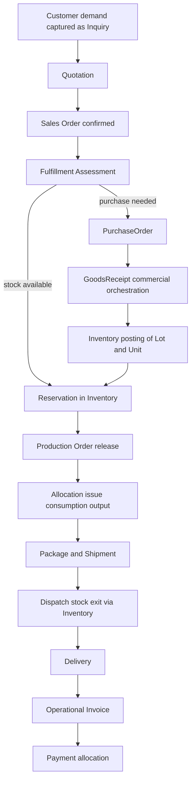
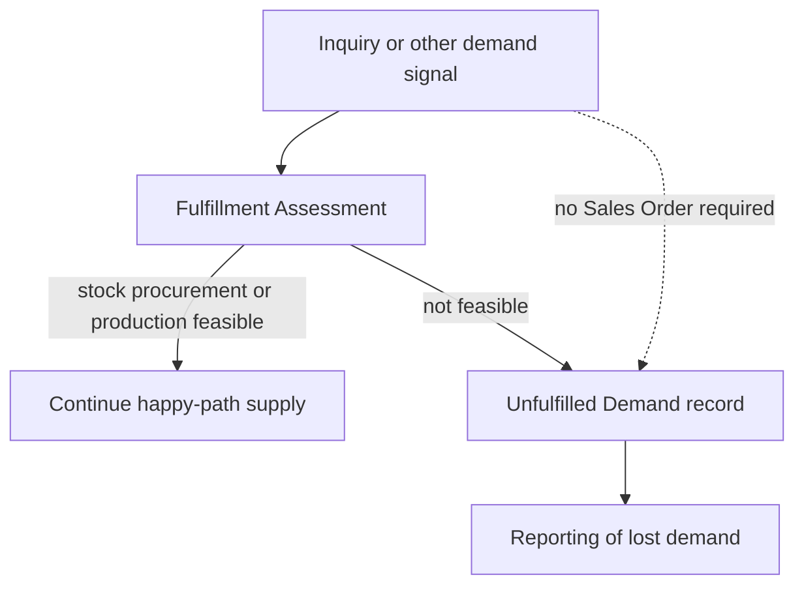
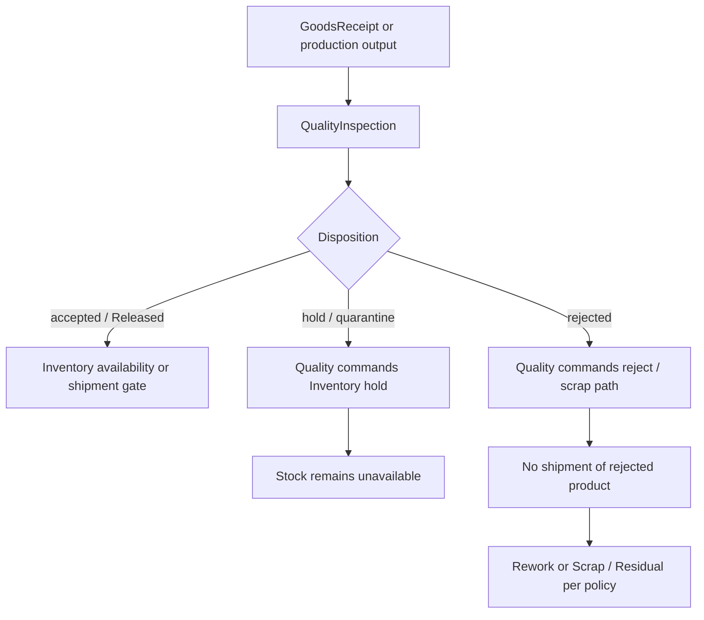
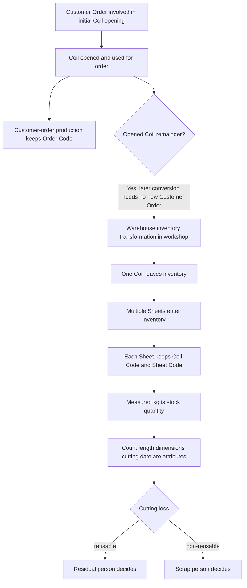
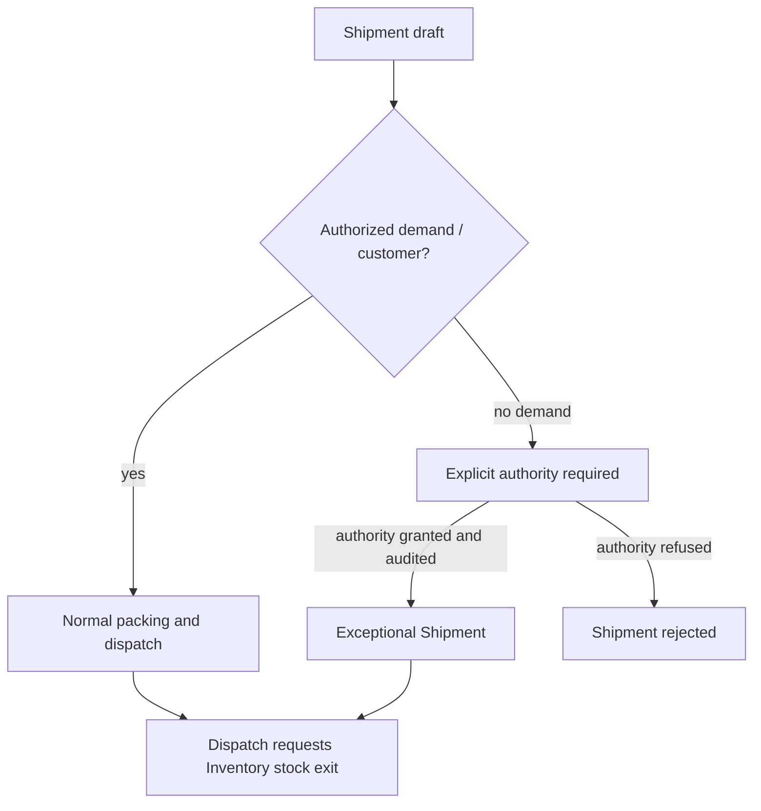

# As-Is and To-Be Process Maps

## Current evidence precedence (2026-10-04)

APR-004 remains historical structure-approval evidence; this technical revision
is made under delegated ADR-0012 authority and does not approve a new baseline.
Live OQ-009/factory evidence supersedes automatic numeric Residual/Scrap
classification: a person decides reusability; recording and authority stay open.
OQ-006 is fulfillment tolerance only. Production mass-balance/process-loss
policy remains open under production evidence/OQ-009 and must not inherit its
zero default. Missing required later-slice policy stays GUARD_OPEN_POLICY.
Quality is future-only; portal MVP is isolated visibility-only; personal
operator accounts apply. OQ answers/statuses are unchanged. Older draft/seed,
RACI and historical handoff wording cannot override these live facts.

## Purpose

Describe the synthesized As-Is operating picture and the proposed To-Be
inquiry-to-payment flow, including recorded exception paths, for Foolad
Navardkaran ERP/MES. This artifact prepares workshop validation. It is **not** a
field study and **not** an approved operating procedure.

`IMPLEMENTATION_AUTHORIZED` remains `false`.

## Scope

- In scope: As-Is synthesis from Phase 01 sources; To-Be happy path and named
  exceptions from ASM-REPORT-001; mermaid for happy path and at least one
  exception path; explicit list of workshop-unvalidated steps.
- Out of scope: executable workflows, numeric tolerances, real routing steps,
  named approval matrices, closing OQ-001 through OQ-018, and deciding Customer
  Portal MVP (OQ-010 / FIND-001).

## Sources and dependencies

- Sources: [ASM-REPORT-001](../01-project-assimilation/ARCHITECTURE_ASSIMILATION_REPORT.md)
  sections 1, 2, 5, and 6; [GOV-STATES-001](../00-governance/registers/STATE_TRANSITION_CATALOGUE.md);
  [ASM-WORKSHOP-001](../01-project-assimilation/WORKSHOP_AGENDA.md).
- Canonical dependencies: ASM-REPORT-001, [DOM-CAP-BC-001](CAPABILITY_BOUNDED_CONTEXT_MAP.md).
- Temporary identities: [DOM-ROSTER-001](WORKSHOP_ROSTER.md) under ASM-013 /
  FIND-020 / OQ-019. They have no approval authority and do not execute this
  workshop.

## Design

### Provenance of the As-Is picture

The As-Is description is an **architecture synthesis** of SRC-001 / SRC-002 as
assimilated in ASM-REPORT-001. No shop-floor walkthrough, timed observation, or
signed current-state map exists in this repository. Parallel Excel/paper is
recorded as RISK-001. Treat every As-Is step below as **unvalidated current
practice**.

### As-Is — fragmented Excel and paper

Proposed current-state picture (synthesis only):

1. [Customer](../00-governance/registers/BUSINESS_GLOSSARY.md#term-001--customer)
   (TERM-001) demand arrives by informal channel (phone, message, spreadsheet,
   paper). Capture is inconsistent; an [Inquiry](../00-governance/registers/BUSINESS_GLOSSARY.md#term-002--inquiry)
   (TERM-002) may never be recorded.
2. [Quotation](../00-governance/registers/BUSINESS_GLOSSARY.md#term-020--quotation)
   (TERM-020) and [Sales Order](../00-governance/registers/BUSINESS_GLOSSARY.md#term-003--sales-order)
   (TERM-003) commitments live in spreadsheets or documents that can be edited
   without snapshot/reversal evidence (ASM-012 is a proposed To-Be control, not
   As-Is fact).
3. [Fulfillment Assessment](../00-governance/registers/BUSINESS_GLOSSARY.md#term-004--fulfillment-assessment)
   (TERM-004) is informal: stock, purchase, or make decisions are not a
   governed record. [Unfulfilled Demand](../00-governance/registers/BUSINESS_GLOSSARY.md#term-005--unfulfilled-demand)
   (TERM-005) is easily lost or confused with overdue demand.
4. Purchasing and inbound receiving use supplier documents and paper
   [Goods Receipt](../00-governance/registers/BUSINESS_GLOSSARY.md#term-019--goods-receipt)
   (TERM-019) notes that are not coordinated with a single stock ledger.
5. Warehouse stock of [Material Lot](../00-governance/registers/BUSINESS_GLOSSARY.md#term-006--material-lot)
   (TERM-006), [Inventory Unit](../00-governance/registers/BUSINESS_GLOSSARY.md#term-007--inventory-unit)
   (TERM-007), and [Coil](../00-governance/registers/BUSINESS_GLOSSARY.md#term-008--coil)
   (TERM-008) is maintained in Excel or local lists. [Reservation](../00-governance/registers/BUSINESS_GLOSSARY.md#term-009--reservation)
   (TERM-009), production [Material Allocation](../00-governance/registers/BUSINESS_GLOSSARY.md#term-010--material-allocation)
   (TERM-010), and actual consumption are not reliably distinct.
6. Production execution, [Residual](../00-governance/registers/BUSINESS_GLOSSARY.md#term-012--residual)
   (TERM-012), [Scrap](../00-governance/registers/BUSINESS_GLOSSARY.md#term-013--scrap)
   (TERM-013), rework, and [Genealogy](../00-governance/registers/BUSINESS_GLOSSARY.md#term-015--genealogy)
   (TERM-015) depend on operator memory, labels, and disconnected sheets.
7. Quality hold/release and [Released](../00-governance/registers/BUSINESS_GLOSSARY.md#term-016--released)
   (TERM-016) status may exist on paper forms without a single availability gate.
8. [Shipment](../00-governance/registers/BUSINESS_GLOSSARY.md#term-017--shipment)
   (TERM-017) and delivery confirmation are not guaranteed to be the only stock
   exit. [Finance-Lite](../00-governance/registers/BUSINESS_GLOSSARY.md#term-018--finance-lite)
   (TERM-018) invoices/payments may lag or live in a separate workbook.
9. Customer Portal is not an observed As-Is channel in the assimilation; it is a
   To-Be product conflict (OQ-010), not a current-state fact.

Success criterion from ASM-REPORT-001: MVP is successful only when a real
purchase-to-delivery cycle can run **without parallel Excel** and balances,
audit trail, and genealogy reconcile. That remains a target, not a measured
As-Is baseline.

### To-Be — inquiry to payment (happy path)

The To-Be happy path is the canonical flow from ASM-REPORT-001. It is proposed.
Lifecycle names cite [GOV-STATES-001](../00-governance/registers/STATE_TRANSITION_CATALOGUE.md)
and remain Phase 03 work. Guards, actors, and side effects are
workshop-unvalidated.

The earlier QC steps in that proposal are **deferred** under OQ-005.
The current factory has no QC department or Quality role, and current
receiving, production completion, inventory availability, and shipment
do not require inspection or Quality release.

Proposed sequence:

1. Record Customer and Inquiry even if the demand may never become a Sales
   Order.
2. Issue Quotation with snapshotted commercial values (ASM-012 proposed).
3. Confirm Sales Order (SM-SALES-ORDER proposed path through CONFIRMED).
4. Record Fulfillment Assessment: stock path, procurement path, production path,
   or not feasible (the last is an exception, not the happy path).
5. If stock available: create Reservation in `BC-INVENTORY` (command from
   `BC-SALES`; Inventory writes Reservation).
6. If purchase needed: create PurchaseOrder; receive via GoodsReceipt
   **commercial orchestration** in `BC-PROCUREMENT`; **Inventory Posting Service** posts Material Lot / Inventory Unit
   stock (split in DOM-CAP-BC-001).
7. Plan/release [Production Order](../00-governance/registers/BUSINESS_GLOSSARY.md#term-011--production-order)
   (TERM-011). Allocate material (TERM-010). Issue to production through
   Inventory posting.
8. Complete operations with atomic consumption, output, residual, scrap,
   genealogy source facts, and coordinated inventory postings (posting points
   open: OQ-003).
9. Pack; create Shipment whose items belong to the authorized demand/customer;
    dispatch requests definitive stock exit through Inventory.
10. Confirm delivery; issue operational Invoice; allocate Payment
    (Finance-Lite). Sales Order close is independent of payment (OQ-007):
    remaining valid demand already zero (`FULFILLED`), authorized unfulfilled
    remainder, or `CANCELLED`. Shipment `DELIVERED` is not an independent
    close prerequisite. The factory has not defined who amends or cancels a
    customer order, or what a change does to reservation or production.
    Architecture cancel and change commands are not a factory procedure.

Steps 9 and 10 are the architecture proposal. The factory has not named
who packs, loads, dispatches, or confirms delivery. Those steps are not
deleted. They are not a factory logistics procedure, and they do not make
`DELIVERED` a Sales Order close.

Customer Portal MVP is **visibility-only** (OQ-010 recorded). Ordering is
not a step on this happy path (`PortalPlaceOrder` remains rejected).

### Factory commercial evidence (`2026-09-30`)

This does not replace the sequence above and does not add invoice states.

- Sales registers the customer order from available warehouse stock.
  Estimated amount = required weight × price per kg.
- Mr. Dinavand receives the order and defines the route when production
  is required.
- Mr. Karimi calculates the final order weight. That weight is commercial
  evidence. The weighbridge still does not write the Inventory Ledger.
- Final amount = actual/final weighbridge weight × applicable price per kg
  + cutting service fee.
- Mr. Pour-Ebrahim issues the customer invoice and gives it to
  Mr. Ghaffari. Mr. Ghaffari creates the corresponding record and uploads
  it to an unrelated external system. He does not issue the invoice.
  The upload is not a Legal-GL API.
- Payment methods: deposit with remainder after delivery; cheque or
  promissory note; known-customer credit. None of these close the Sales
  Order. None is recorded as required before shipment. Ms. Koushki
  follows up receivables. The factory has not named who records a
  payment, an invoice link, cheque or note settlement, a credit limit,
  a customer balance, or a payment reversal. Finance-Lite allocation
  stays architecture and is not redesigned.
- Ms. Masoumi's purchase proformas are not the customer invoice.
- Step 11's "issue operational Invoice" after delivery confirmation remains
  the architecture proposal. The factory did not state invoice timing
  versus shipment. That timing stays open. Payment allocation is unchanged.

### Incoming material (`2026-09-30`)

One warehouse intake station, associated with Mr. Karimi
(Warehousekeeper; questionnaire also says Warehouse Manager). Materials
include Coil, Sheet, angle, beam, and similar types. Record Internal
Code, Count, Weight, and Type. Count is not a second stock ledger.
Official quantity is measured kg. No weight-per-piece conversion.

Procurement document types, including a Purchase Order, are architecture
candidates. The factory has not confirmed that lifecycle. Ms. Masoumi
registers purchases and sends proformas. That is not approval, receiving,
or the inventory post. Warehouse intake records physical arrival. Quantity is posted only
by `PostGoodsReceipt` (Lot + Inventory Unit + Ledger) through the
Inventory Posting Service.

The earlier proposed step 6 included "inbound quality as required."
That QC branch is retained only in the future flow below. The current
factory has no QC department, and intake does not require Quality approval.

A standalone incoming Sheet has no fabricated Coil parent. A Sheet made
from a Coil keeps the Coil trace. Angle and beam have no invented
transformation. Normal receiving is not opening-stock cutover (OQ-015).
No scale or protocol is defined for the intake weight.

```mermaid
flowchart TD
  A[Customer demand captured as Inquiry] --> B[Quotation]
  B --> C[Sales Order confirmed]
  C --> D[Fulfillment Assessment]
  D -->|stock available| E[Reservation in Inventory]
  D -->|purchase needed| F[PurchaseOrder]
  F --> G[GoodsReceipt commercial orchestration]
  G --> I[Inventory posting of Lot and Unit]
  I --> E
  E --> J[Production Order release]
  J --> K[Allocation issue consumption output]
  K --> M[Package and Shipment]
  M --> N[Dispatch stock exit via Inventory]
  N --> O[Delivery]
  O --> P[Operational Invoice]
  P --> Q[Payment allocation]
```

### To-Be exception paths

All exception names below are required by ASM-REPORT-001. Numeric policy,
authority, and posting points are **not** decided here.

#### Partial fulfillment

A Sales Order may be partially reserved, partially produced, and partially
shipped (SM-SALES-ORDER includes PARTIALLY_FULFILLED; SM-SHIPMENT includes
PARTIALLY_DELIVERED). Over-production and over-delivery tolerances are
governed by the answered OQ-006 default-zero rule. Non-default limits require evidence per
product family.

#### Unfulfilled demand without a Sales Order

If no feasible stock, procurement, or production path exists, the business
records Unfulfilled Demand as a distinct outcome. It is not overdue demand and
**may exist without a Sales Order**. Both remain separately reportable.

```mermaid
flowchart TD
  A[Inquiry or other demand signal] --> B[Fulfillment Assessment]
  B -->|stock procurement or production feasible| C[Continue happy-path supply]
  B -->|not feasible| D[Unfulfilled Demand record]
  D --> E[Reporting of lost demand]
  A -.->|no Sales Order required| D
```

#### Procurement-driven path

Fulfillment Assessment may select purchase even when a Sales Order exists
without currently available stock. PurchaseOrder proceeds independently through
SM-PURCHASE-ORDER until GoodsReceipt. Physical stock becomes available only
after a valid Inventory posting commits. The resulting normal Inventory Unit
is then `AVAILABLE` for permitted use under existing guards (INV-003); QC
release is not a current-MVP prerequisite. Reservation against that stock
is a later Inventory write, not a Procurement write.

#### QC hold / reject

Current factory evidence (`2026-09-30`): there is no Quality Control
department, QC is outside the current MVP, and there is no Quality role
or Quality personnel. The flow below is retained as **future** Quality
capability. It is not current factory operation. It is not deleted, and
it is not a reason to invent a QC workflow or a Quality employee.

Inbound, in-process, or final inspection may hold, quarantine, reject, or
conditionally release (SM-QUALITY-INSPECTION). Material cannot become available
or shippable while required QC is pending, quarantined, or rejected. Quality
**commands** Inventory lifecycle changes; Quality does not write stock tables.

```mermaid
flowchart TD
  A[GoodsReceipt or production output] --> B[QualityInspection]
  B --> C{Disposition}
  C -->|accepted / Released| D[Inventory availability or shipment gate]
  C -->|hold / quarantine| E[Quality commands Inventory hold]
  E --> F[Stock remains unavailable]
  C -->|rejected| G[Quality commands reject / scrap path]
  G --> H[No shipment of rejected product]
  H --> I[Rework or Scrap / Residual per policy]
```

Rework, residual, and scrap after reject remain workshop-unvalidated. Residual
versus scrap is the human reusability decision recorded on OQ-009; its recording/authority remains open.

#### Rework

Rework is a Production fact with genealogy impact (merge/split/rework must
remain traceable). It is not a silent edit of prior consumption/output. Posted
records are corrected by reversal, not deletion (ASM-006 proposed). Detailed
rework routing is not in the sources as a validated map (OQ-003).

#### Residual

Usable remainder after consumption/splitting becomes a **new child Inventory
Unit** linked to its parent; the parent is closed/split (TERM-012). Production
writes the residual fact; Inventory writes resulting identity and quantity.
Automatic usable-dimension/weight classification is prohibited (OQ-009). Factory
clarification: reusable waste is Residual and returns to the warehouse
as a business disposition. The Production/Workshop Manager decides
reusability. The system must not classify from weight or dimensions.
No universal numeric cutoff is defined. That return is not a new
posting command. The factory has not defined process loss. A weight
difference is not process loss. Not every Station consumes a unit or
posts stock. The factory has not named partial or complete consumption.
For a valid accepted residual stock-in, the resulting child Inventory
Unit is `AVAILABLE` after the posting transaction commits (INV-003).
This is an architecture consequence, not a new factory procedure.

#### Scrap

Scrap is a typed disposition fact (TERM-013) with quantity, reason, origin, and
genealogy impact. Production writes the scrap fact; Inventory Posting Service
writes any associated stock movement. Scrap is not a spreadsheet adjustment.
Factory meeting FACT-02 requires order scrap to carry the relevant customer
order code; that does not by itself make scrap an Inventory Unit.
Non-reusable waste is Scrap. No disposal process is defined. An earlier
Scrap Code / unique-part mention is historical and does not require a
code on every tiny scrap piece. A weight difference is not Scrap.

#### Coil → Sheet (factory evidence through C-07)

Factory business evidence. **Not** an accepted change to
`CompleteProductionOperation`, `CreateResidualUnit`, or DATA-TX-001.
No new command or entity is created here.

The factory calls Context A **"conversion of Coil to Sheet for warehouse"**
and an **inventory transformation**.

**Initial opening/use (C-07).** A Customer Order must be involved when a Coil is
initially opened/used for Coil → Sheet processing. This does not establish
that the triggering demand must technically be a Production Order. It does
not permit speculative opening of an intact Coil without demand.

**Context A — warehouse conversion after that order.** Opened-Coil
remainder may be converted to Sheets without another/new Customer Order
and without a Production Order for this remainder transformation. The
remainder may stay temporarily on the roll-opening machine. Once the Coil
is opened it cannot be re-rolled; the remainder ultimately becomes
Sheets. No time limit or automatic schedule is defined. This activity is
separate from customer-order production. One Coil leaves inventory;
multiple Sheets enter. The relationship Source Coil → resulting Sheets is
retained. Resulting Sheets
may be directly saleable and/or allocatable. They need not be allocated
at once.

Architecture consequence only: once the still-unresolved Coil → Sheet
posting boundary is accepted and validly commits resulting Sheet stock,
those Sheets are `AVAILABLE` for permitted use without QC release
(INV-003). This does not define that posting command.

**Context B — customer-order-related production.** The initial Coil
opening/use has a Customer Order involved. That context keeps the Order Code
on associated material. Do not collapse Context B into Context A.

**Place and decision.** The operation is in the workshop, under the
Production/Workshop Manager. Identified person: Mr. Dinavand. Source
titles vary (Workshop Manager / Production Manager). That is not an
`ACT-*` or SoD assignment.

**Coil-derived Sheet attributes:** original Coil Code; Sheet Code
(factory format: Coil Code + Sheet number; global uniqueness not
confirmed by the factory); Order Code when applicable; Sheet count;
total measured weight (kg, official stock quantity); individual length;
dimensions; cutting date.

6 m and 12 m are example market lengths, not an allowed-length catalogue.

Cutting loss may be reusable (Residual) or non-reusable (Scrap). No
universal numeric cutoff. The manager decides. Do not auto-classify.

**Standalone incoming Sheet.** Not Coil-derived. New unique product code.
Do not invent a Coil Code. Do not use Coil-derived genealogy.

**Open conflict.** Live production posting still nests residual/scrap of
a production operation inside `CompleteProductionOperation`. Factory
Context A may have no Production Order. The posting boundary for Context
A is not decided.

```mermaid
flowchart TD
  A[Customer Order involved in initial Coil opening] --> B[Coil opened and used for order]
  B --> D[Customer-order production keeps Order Code]
  B --> R{Opened Coil remainder?}
  R -->|Yes, later conversion needs no new Customer Order| C[Warehouse inventory transformation in workshop]
  C --> E[One Coil leaves inventory]
  E --> F[Multiple Sheets enter inventory]
  F --> G[Each Sheet keeps Coil Code and Sheet Code]
  G --> H[Measured kg is stock quantity]
  H --> I[Count length dimensions cutting date are attributes]
  I --> J{Cutting loss}
  J -->|reusable| K[Residual person decides]
  J -->|non-reusable| L[Scrap person decides]
```

#### Cancellation

Sales Order, PurchaseOrder, Production Order, GoodsReceipt, and Shipment have
proposed cancel/hold branches in GOV-STATES-001. Post-confirmation Sales Order
changes require SalesOrderChange rather than regression to Draft. Posted
GoodsReceipt cancellation requires reversal rather than direct state
regression. Responsible roles and guards are unvalidated.

#### Reversal correction

Posted inventory, operational, and financial records are not physically deleted
or silently edited. Corrections use reversal/correction with reason, authority,
timestamp, and linked evidence (ASM-006, ASM-012). Inventory Posting mechanism
for reversals uses the answered OQ-017 app-owned PostgreSQL transaction; affected
correction policy/authority remains open.

#### Shipment without demand — explicit authority required

Shipment content must belong to the same authorized customer/order and
reference the permitted Package or Product Batch form. **Shipment without
demand requires explicit authority.** No named authority matrix exists yet
(workshop agenda section 5; OQ-005 related for exceptional release). This map
records the invariant; it does not invent an approver.

```mermaid
flowchart TD
  A[Shipment draft] --> B{Authorized demand / customer?}
  B -->|yes| C[Normal packing and dispatch]
  B -->|no demand| D[Explicit authority required]
  D -->|authority granted and audited| E[Exceptional Shipment]
  D -->|authority refused| F[Shipment rejected]
  C --> G[Dispatch requests Inventory stock exit]
  E --> G
```

### Steps that remain workshop-unvalidated

Workshop execution is blocked until real names replace `(temporary)` roster
rows (OQ-019). Until then, **every To-Be step is unvalidated**. The following
are specifically evidence-gated and must not be treated as confirmed:

| Area | Unvalidated until workshop / owner evidence | Linked records |
| --- | --- | --- |
| Entire As-Is Excel/paper picture | Field study, forms, sample records | RISK-001; workshop agenda §2 |
| Named owners, delegates, approval limits | Real roster replacement | OQ-019, ASM-013, FIND-020 |
| UOM, weight vs length, rounding | kg↔length formula still missing. Weight measurement: 0 decimal places, 1 kg, rounding not needed. Weight difference must be shown; no automatic measurement tolerance. That is not OQ-006 | OQ-001 still treating; OQ-002 answered; OQ-006 unchanged |
| Official consumption/output posting **step names** and routing | Per-order route by Mr. Dinavand; some Stations may be skipped; Entry/Referral are not Start/Complete; a Station completion does not post | OQ-003 treating. Ten Stations recorded. Posting remains `CompleteProductionOperation`. No shared Station account. Login and logout are recorded and are not Entry. |
| Tracking granularity and labels | First-go-live family catalogue | OQ-004 answered hybrid |
| QC plans, hold/reject authority, exceptional release | Current factory: no QC department and no Quality person. Future plans and named releasers if Quality is later enabled | OQ-005 treating. Future capability retained. Not current MVP execution. |
| Partial fulfillment / over-delivery numeric limits | Family/customer % | OQ-006 answered default 0 |
| Sales Order closure vs payment | Recorded policy | OQ-007 answered |
| Reservation uniqueness and confirmed-SO expiry | Recorded policy | OQ-008 answered |
| Residual vs scrap disposition | Reusable = Residual and returns to the warehouse; non-reusable = Scrap; person decides; no universal cutoff; do not classify from measurements | OQ-009 still treating for recording/authority and affected policy. Numeric classifier and below-threshold branch are superseded for current MVP; missing human disposition still rejects |
| Opened-Coil remainder → Sheet warehouse conversion | Factory: initial opening/use requires a Customer Order; later remainder conversion needs no new Customer Order and is an inventory transformation; posting command not accepted | FACT-03 / C-07. Not nested into `CompleteProductionOperation` or DATA-TX-001 |
| Portal visibility document list | Sponsor residual list | OQ-010 answered visibility-only; no `PortalPlaceOrder` |
| Weighbridge identity and fallback | Equipment evidence | OQ-011 residual. Commander only. |
| Invoice/payment vs legal accounting handoff | Accounting product when a later phase needs it. Factory upload target is unnamed and is not that product. | OQ-012 answered: no Legal-GL in MVP |
| Single-site / legal-entity assumption | — | OQ-013 answered |
| Opening stock freeze and discrepancy workflow | Cutover files and named signers | OQ-015 residual |
| State guards, customer-visible status mappings | Lifecycle walkthrough | GOV-STATES-001; workshop agenda §5 |
| Shipment-without-demand approver | Authority matrix | ASM-REPORT-001 invariant; OQ-005 |

Customer Portal ordering is **not** drawn on the happy path. Visibility-only
MVP is recorded (OQ-010). Exact document list remains residual.

## Alternatives and consequences

An alternative As-Is of "already controlled process" is rejected as
unsupported: sources describe fragmented Excel/paper replacement, not a
measured current MES. Inventing shop-floor timings or forms would create fake
facts.

Keeping Unfulfilled Demand off the Sales Order lifecycle avoids conflating lost
demand with overdue demand (REQ-OBJ-001 / ASM-REPORT-001).

## Traceability

- Requirements: REQ-OBJ-001, REQ-OBJ-003, REQ-OBJ-004 (still proposed).
- Rules/invariants: ASM-REPORT-001 section 5; SM-* in GOV-STATES-001.
- Risks: RISK-001, RISK-002, RISK-005, RISK-007.
- Verification: planned workshop; this draft is not workshop minutes.

## Open items

- Questions: Current status is
  [OPEN_QUESTIONS.md](../00-governance/registers/OPEN_QUESTIONS.md).
  This map does not reopen answered rows. Treating residuals remain
  OQ-001, OQ-003, OQ-005, OQ-009, OQ-011, OQ-014, OQ-015, OQ-019.
  Factory FACT-03 posting-boundary conflict remains open. FACT-05 shared
  station accounts are superseded by personal accounts. A future dedicated
  OQ may still be required for the posting conflict and for Entry/Referral
  beside the Production Operation lifecycle.
- Assumptions: ASM-001 through ASM-014 are not confirmed by these maps.

## Review evidence

- Self-check: [SELF_CHECK.md](SELF_CHECK.md)
- Independent review: [INDEPENDENT_REVIEW.md](INDEPENDENT_REVIEW.md)
- Reconciliation: [RECONCILIATION.md](RECONCILIATION.md)
