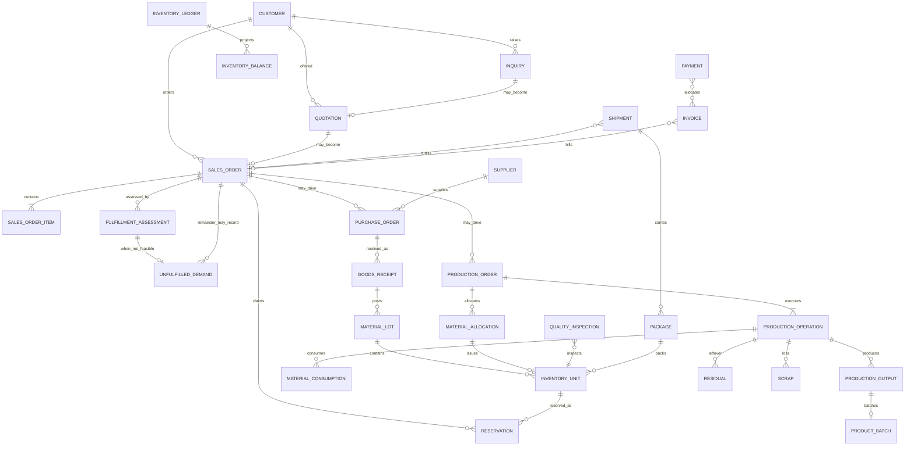

# Logical Data Model

Conceptual entities and relationships already in
[CANONICAL_DATA_DICTIONARY.md](../00-governance/registers/CANONICAL_DATA_DICTIONARY.md)
and
[MODULE_OWNERSHIP_MATRIX.md](../02-domain-business-architecture/MODULE_OWNERSHIP_MATRIX.md).
This is not a physical schema. No table, column type, key algorithm, or
migration is authorized.

`IMPLEMENTATION_AUTHORIZED` remains `false`.

## Rules

- Exactly one write owner per authoritative concept (DOM-OWN-001).
- Quality and Shipping command Inventory; they do not own stock quantities
  (INV-017).
- Genealogy Link is a projection, not an independently editable entity
  (INV-019).
- Coil is a kind of Inventory Unit, not a separate entity.
- ShipmentItem, Dispatch, and Delivery remain Shipment lifecycle facts
  (FIND-023). Do not mint those ENT-* IDs here.
- Quantity type, UOM scale, and rounding stay open (OQ-001 residual).
  Official stock UOM is kg (OQ-001/OQ-002 recorded).
- Official routing **step names** stay open (OQ-003 residual). The
  posting **boundary** is `CompleteProductionOperation`.
- First-go-live family tracking catalogue stays configuration (OQ-004
  recorded hybrid grain).
- Genealogy Link is rebuilt from DATA-GEN-001 source facts, not from
  Ledger rows alone (FIND-G-014). Balance rebuilds from Ledger.
- Sales Order close predicate is recorded (OQ-007). Payment is not a
  close attribute.
- One `ACTIVE` reservation per Inventory Unit is recorded (OQ-008).

## Write-owner groups

| Write owner | Entities |
| --- | --- |
| Sales | Customer, Inquiry, Quotation, Sales Order, Sales Order Item, Fulfillment Assessment, Unfulfilled Demand |
| Procurement | Supplier, Purchase Order, Goods Receipt (orchestration) |
| Inventory / ACT-IPS | Material Lot, Inventory Unit, Inventory Ledger, Inventory Balance, Reservation; Goods Receipt stock posting; Residual resulting unit; Scrap stock movement |
| Production | Production Order, Material Allocation, Production Operation, Material Consumption, Production Output, Residual fact, Scrap fact, Product Batch |
| Quality | Quality Inspection |
| Shipping | Package, Shipment |
| Finance-Lite | Invoice, Payment |
| none as truth | Genealogy Link (rebuildable projection) |

## Relationships

At most one `RESERVATION` per `INVENTORY_UNIT` may be in state `ACTIVE`
(OQ-008). The `||--o{` edge allows historical non-`ACTIVE` rows.
`UNFULFILLED_DEMAND` may exist without a Sales Order (INV-013). The
optional remainder edge is the OQ-007 close path, not a required FK.

Invoice bills a Sales Order; that does not couple their close machines.

Genealogy Link is intentionally absent as a source entity. Rebuild it
from Lot origin, Consumption, Output, Residual, Scrap, Package,
Shipment, and Rework facts (DATA-GEN-001). Rework is a Production
operation/fact plus reversals (`StartReworkOperation`); this model does
not mint ENT-REWORK.

## Attributes that may be named now

Identity, write owner, lifecycle state (from the matching SM-*),
commercial snapshot fields already required by INV-014, reason/actor
role/authority/timestamp on reversals (INV-005), caller idempotency
key (INV-016), Sales Order closure reason and fulfilled/unfulfilled qty
snapshot (OQ-007), and Reservation demand ref / unit ref / claimed qty /
state with at most one `ACTIVE` per Inventory Unit (OQ-008).

## Attributes that stay open

| Attribute family | Why open |
| --- | --- |
| Quantity type, UOM, decimals, rounding | OQ-001 residual. Official stock UOM is kg (OQ-001/OQ-002 recorded). |
| Official operation step **name** | OQ-003 residual. Posting **boundary** is `CompleteProductionOperation` (recorded). |
| Batch vs bundle vs piece identity | OQ-004 recorded hybrid grain; first-go-live family catalogue is configuration |
| QC plan, limit, sample, named releaser | OQ-005 residual. QC can block; exceptional release is two-person. |
| Tolerance percents and over-delivery family % | OQ-006 configuration. Default 0 is recorded. |
| Residual cutoff | OQ-009 residual numbers |
| Site / legal-entity discriminator | Not required for MVP. OQ-013 recorded: one legal entity, one principal site. |
| Physical types, indexes, volumes | OQ-014 residual |
| Opening-stock source keys | OQ-015 residual |
| Retention days | OQ-016 residual. RPO/RTO recorded. |
| Ledger physical schema / function syntax | OQ-017 residual. Posting **style** is recorded (app-owned PostgreSQL transaction). |

Do not invent a column type to stand in for those answers.

Named attributes live in
[LOGICAL_ATTRIBUTE_CATALOGUE.md](LOGICAL_ATTRIBUTE_CATALOGUE.md).
Enforcement assignment lives in
[ENFORCEMENT_ASSIGNMENT.md](ENFORCEMENT_ASSIGNMENT.md).
Cutover and retention live in
[RETENTION_MIGRATION_OPENING_STOCK.md](RETENTION_MIGRATION_OPENING_STOCK.md).
