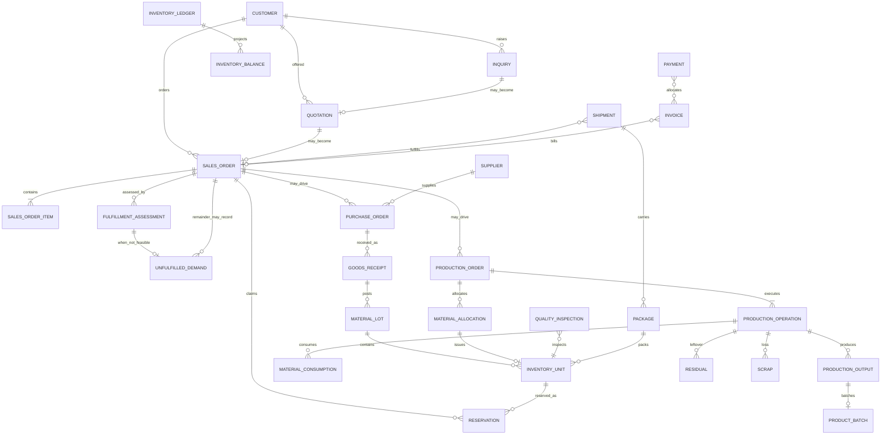

# Logical Data Model

APR-006 retains historical structure approval. Current factory/source
reconciliation is delegated pre-implementation work, not human baseline approval.

Conceptual entities and relationships already in
[CANONICAL_DATA_DICTIONARY.md](../00-governance/registers/CANONICAL_DATA_DICTIONARY.md)
and
[MODULE_OWNERSHIP_MATRIX.md](../02-domain-business-architecture/MODULE_OWNERSHIP_MATRIX.md).
This is not a physical schema. No table, column type, key algorithm, or
migration is authorized.

`IMPLEMENTATION_AUTHORIZED` remains `false`.

OQ-005 scope: Quality Inspection and its relationship below are
future/deferred logical concepts only. The current MVP has no QC
department, Quality role, mandatory inspection, quarantine, or Quality
release. Existing `AVAILABLE` is the current-MVP normal Unit state after
valid stock-in commits (INV-003); no physical schema or replacement status
is defined.

## Rules

- Exactly one write owner per authoritative concept (DOM-OWN-001).
- Quality and Shipping command Inventory; they do not own stock quantities
  (INV-017).
- Genealogy Link is a projection, not an independently editable entity
  (INV-019).
- Coil is a kind of Inventory Unit, not a separate entity.
- ShipmentItem, Dispatch, and Delivery remain Shipment lifecycle facts
  (FIND-023). Do not mint those ENT-* IDs here.
- Quantity type, UOM scale, and rounding stay open (OQ-001 residual).
  Official stock UOM is kg (OQ-001/OQ-002 recorded).
- Ten physical Station names and Station=Production Step are recorded in OQ-003.
  Versioned per-order routing, Entry/Referral persistence, lifecycle and stop/cancel
  semantics remain residual. Posting boundary is `CompleteProductionOperation`.
- First-go-live family tracking catalogue stays configuration (OQ-004
  recorded hybrid grain).
- Genealogy Link is rebuilt from DATA-GEN-001 source facts, not from
  Ledger rows alone (FIND-G-014). Balance rebuilds from Ledger.
- Sales Order close predicate is recorded (OQ-007). Payment is not a
  close attribute.
- One `ACTIVE` reservation per Inventory Unit is recorded (OQ-008).
- Ledger movements remain kg quantity truth; Balance is rebuildable.
  Inventory Unit `AVAILABLE` expresses lifecycle eligibility for normal
  use after valid stock-in commits, subject to existing guards (INV-003).
  It is not a parallel quantity ledger or an unconditional shipment right.

## Write-owner groups

| Write owner | Entities |
| --- | --- |
| Sales | Customer, Inquiry, Quotation, Sales Order, Sales Order Item, Fulfillment Assessment, Unfulfilled Demand |
| Procurement | Supplier, Purchase Order, Goods Receipt (orchestration) |
| Inventory / ACT-IPS | Material Lot, Inventory Unit, Inventory Ledger, Inventory Balance, Reservation; Goods Receipt stock posting; Residual resulting unit; Scrap stock movement |
| Production | Production Order, Material Allocation, Production Operation, Material Consumption, Production Output, Residual fact, Scrap fact, Product Batch |
| Quality (future only) | Quality Inspection (future only) |
| Shipping | Package, Shipment |
| Finance-Lite | Invoice, Payment |
| none as truth | Genealogy Link (rebuildable projection) |

Factory intake (`2026-09-30`) does not add an entity or a second quantity.
Internal Code, Count, and Type are intake attributes. Weight in kg is the
Ledger quantity. A standalone incoming Sheet is not given a Coil parent.
Goods Receipt is not the whole genealogy model. No schema is created here.
Entry, Referral, login, and logout are not new entities in this model.
A Station completion is not a Ledger row.

## Relationships

```mermaid
erDiagram
  CUSTOMER ||--o{ INQUIRY : raises
  CUSTOMER ||--o{ QUOTATION : offered
  CUSTOMER ||--o{ SALES_ORDER : orders
  INQUIRY ||--o| QUOTATION : may_become
  QUOTATION ||--o| SALES_ORDER : may_become
  SALES_ORDER ||--|{ SALES_ORDER_ITEM : contains
  SALES_ORDER ||--o{ FULFILLMENT_ASSESSMENT : assessed_by
  FULFILLMENT_ASSESSMENT ||--o| UNFULFILLED_DEMAND : when_not_feasible
  SALES_ORDER ||--o{ RESERVATION : claims
  SALES_ORDER ||--o{ PURCHASE_ORDER : may_drive
  SALES_ORDER ||--o{ PRODUCTION_ORDER : may_drive
  SUPPLIER ||--o{ PURCHASE_ORDER : supplies
  PURCHASE_ORDER ||--o{ GOODS_RECEIPT : received_as
  GOODS_RECEIPT ||--o{ MATERIAL_LOT : posts
  MATERIAL_LOT ||--o{ INVENTORY_UNIT : contains
  INVENTORY_LEDGER ||--o{ INVENTORY_BALANCE : projects
  INVENTORY_UNIT ||--o{ RESERVATION : reserved_as
  SALES_ORDER ||--o{ UNFULFILLED_DEMAND : remainder_may_record
  PRODUCTION_ORDER ||--o{ MATERIAL_ALLOCATION : allocates
  PRODUCTION_ORDER ||--|{ PRODUCTION_OPERATION : executes
  MATERIAL_ALLOCATION ||--o| INVENTORY_UNIT : issues
  PRODUCTION_OPERATION ||--o{ MATERIAL_CONSUMPTION : consumes
  PRODUCTION_OPERATION ||--o{ PRODUCTION_OUTPUT : produces
  PRODUCTION_OPERATION ||--o{ RESIDUAL : leftover
  PRODUCTION_OPERATION ||--o{ SCRAP : loss
  PRODUCTION_OUTPUT ||--o| PRODUCT_BATCH : batches
  QUALITY_INSPECTION }o--|| INVENTORY_UNIT : inspects
  PACKAGE ||--o{ INVENTORY_UNIT : packs
  SHIPMENT ||--o{ PACKAGE : carries
  SHIPMENT }o--o| SALES_ORDER : fulfills
  INVOICE }o--o| SALES_ORDER : bills
  PAYMENT }o--o{ INVOICE : allocates
```

At most one `RESERVATION` per `INVENTORY_UNIT` may be in state `ACTIVE`
(OQ-008). The `||--o{` edge allows historical non-`ACTIVE` rows.
`UNFULFILLED_DEMAND` may exist without a Sales Order (INV-013). The
optional remainder edge is the OQ-007 close path, not a required FK.

Invoice bills a Sales Order; that does not couple their close machines.

Genealogy Link is intentionally absent as a source entity. Rebuild it
from Lot origin, Consumption, Output, Residual, Scrap, Package,
Shipment, and Rework facts (DATA-GEN-001). Rework is a Production
operation/fact plus reversals (`StartReworkOperation`); this model does
not mint ENT-REWORK.

## Attributes that may be named now

Identity, write owner, lifecycle state (from the matching SM-*),
commercial snapshot fields already required by INV-014, reason/actor
role/authority/timestamp on reversals (INV-005), caller idempotency
key (INV-016), Sales Order closure reason and fulfilled/unfulfilled qty
snapshot (OQ-007), and Reservation demand ref / unit ref / claimed qty /
state with at most one `ACTIVE` per Inventory Unit (OQ-008).

## Attributes that stay open

| Attribute family | Why open |
| --- | --- |
| Quantity type, UOM, decimals, rounding | OQ-001 residual. Official stock UOM is kg (OQ-001/OQ-002 recorded). |
| Operation workflow/versioned route | OQ-003 residual; ten physical Stations/Step names recorded. Posting **boundary** is `CompleteProductionOperation`. |
| Batch vs bundle vs piece identity | OQ-004 recorded hybrid grain; first-go-live family catalogue is configuration |
| QC plan, limit, sample, named releaser | OQ-005 future residual only. Future QC could block and use two-person exceptional release if separately enabled; none is a current-MVP input. |
| Tolerance percents and over-delivery family % | OQ-006 configuration. Default 0 is recorded. |
| Residual/Scrap human disposition recording | OQ-009: Production/Workshop Manager decides reusability; no automatic weight/dimension cutoff or universal threshold |
| Site / legal-entity discriminator | Not required for MVP. OQ-013 recorded: one legal entity, one principal site. |
| Physical types, indexes, volumes | OQ-014 residual |
| Opening-stock source keys | OQ-015 residual. `OpeningStockImport` is an architecture candidate, not a factory-confirmed Goods Receipt, and not a second Ledger writer. |
| Retention days | OQ-016 residual. RPO/RTO recorded. |
| Ledger physical schema / function syntax | OQ-017 residual. Posting **style** is recorded (app-owned PostgreSQL transaction). |

Do not invent a column type to stand in for those answers.

Named attributes live in
[LOGICAL_ATTRIBUTE_CATALOGUE.md](LOGICAL_ATTRIBUTE_CATALOGUE.md).
Enforcement assignment lives in
[ENFORCEMENT_ASSIGNMENT.md](ENFORCEMENT_ASSIGNMENT.md).
Cutover and retention live in
[RETENTION_MIGRATION_OPENING_STOCK.md](RETENTION_MIGRATION_OPENING_STOCK.md).
