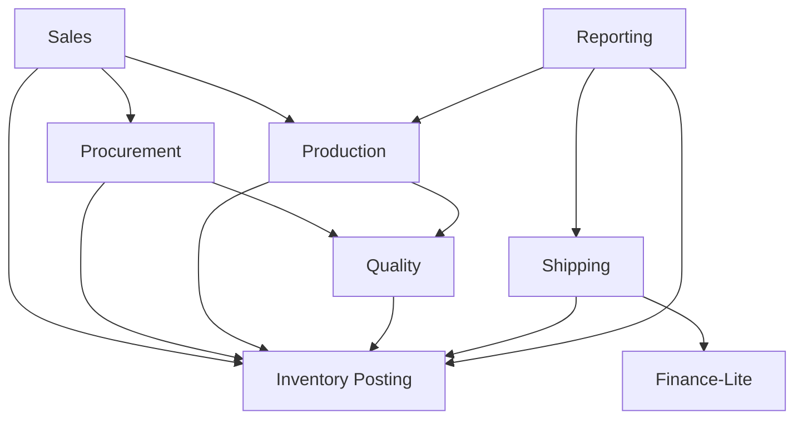

# Application Module Dependency Map

One module per write-owning bounded context, plus an Inventory Posting
module that other modules **command**. Shape is the accepted Modular
Monolith (ADR-0006). Process split into services, packages, and folder
layout stay OQ-018 residual.

`IMPLEMENTATION_AUTHORIZED` remains `false`.

## Modules

| Module | Writes | May command | Must not depend on |
| --- | --- | --- | --- |
| Sales | Inquiry, Quotation, Order, Assessment, Unfulfilled Demand | Inventory (reservation), Procurement, Production | Ledger/Balance tables |
| Procurement | Supplier, PO, GR orchestration | Inventory posting, Quality inbound | Ledger/Balance |
| Inventory Posting | Ledger, Balance, Unit qty, Reservation rows | none for policy | Sales/Production internals |
| Production | Order, Operation, Allocation, consumption/output/residual/scrap facts | Inventory posting, Quality | Ledger/Balance tables |
| Quality | Inspection | Inventory hold/release | Ledger/Balance |
| Shipping | Package, Shipment | Inventory pack/exit | Ledger/Balance |
| Finance-Lite | Invoice, Payment | none for stock | legal GL, Sales Invoice write |
| Identity / Audit | later Phase 06 | none for stock | stock tables |
| Reporting | Genealogy projection only, rebuilt from DATA-GEN-001 source facts | none | source-fact writes; Ledger-only genealogy; `EditGenealogy` |

## Allowed dependency direction

A module may read another module’s published snapshot or query. It may
not write the other module’s tables (INT-001).

## Shared kernel (proposed, not a package)

Command authorization, idempotency key store, and rejection families
live outside any single BC. They are not NestJS, Prisma, or a chosen
library.

## Must not decide here

- NestJS modules, Nx, or package manager
- Separate deployable services versus one process (ADR-0008 remains
  proposed; ADR-0006 Modular Monolith is already accepted)
- Socket.IO or any real-time library
